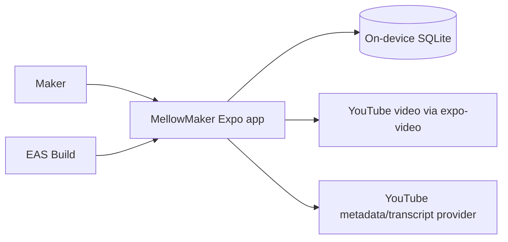

# MellowMaker Architecture

**Status:** Baseline architecture for PRD0  
**Source of truth:** [`vision.md`](./vision.md)  
**Applies to:** iOS and Android application delivered through Expo and EAS

## 1. Purpose

MellowMaker is an offline-first React Native application for crocheters. It combines a stitch dictionary, personal pattern management, interactive steps, persistent row/stitch counters, and structured guides imported from YouTube.

This document turns the product vision into technical boundaries. It intentionally avoids choosing libraries or services that the repository has not yet adopted. When the implementation establishes a convention, update this document in the same change.

## 2. Architectural drivers

1. **Offline-first core:** Stitch content, patterns, imported guide structure, notes, progress, and counters remain usable without connectivity.
2. **Local durability:** User-created data survives navigation, app restarts, and application upgrades.
3. **Cross-platform behavior:** The same product capabilities ship on iOS and Android from an Expo managed project.
4. **Fast interaction:** Counter taps and step completion update immediately and never wait for a network request.
5. **Safe evolution:** SQLite schema changes preserve existing maker data.
6. **Replaceable network integrations:** YouTube metadata and transcript capabilities are isolated from the local domain because provider behavior and availability can change.
7. **Playful, accessible UI:** Visual energy and animation must not compromise legibility, touch ergonomics, or accessibility.

## 3. System context

SQLite is the source of truth for core application state. Network services enrich imported guides and provide video playback; they are not dependencies for opening saved content or recording progress.

## 4. Technology baseline

| Concern | Baseline |
|---|---|
| Application | React Native with Expo managed workflow, SDK 52 or later |
| Language | TypeScript with strict type checking |
| Distribution | EAS builds for iOS (`.ipa`) and Android (`.aab`) |
| Local persistence | `expo-sqlite` |
| Video | `expo-video` |
| Styling | NativeWind v4 |
| Motion | React Native Reanimated |
| Platforms | iOS and Android |
| Navigation | Expo Router typed routes with Stitches, Patterns, and Guides bottom tabs |
| Transient state and forms | React hooks/context and controlled inputs with pure domain validation; no global store or form dependency |
| Unit/component tests | Jest with `jest-expo` and React Native Testing Library |
| SQL integration tests | In-memory `node:sqlite` using shared production SQL/migration inputs |
| Installed-app smoke tests | Maestro on iOS and Android targets |

Network-client libraries remain deliberately unselected. Expo Router owns typed
navigation, while durable state remains SQLite-authoritative. React hooks own
local drafts, focus, loading, and animation; narrowly scoped context may provide
stable dependencies or cross-screen ephemeral coordination, but it must never
become a second durable entity store. Controlled forms trim, parse, and validate
through pure domain functions that return discriminated success or field-error
results. A state, form, or validation dependency should be introduced only when
later feature complexity justifies changing this recorded decision.

## 5. Application boundaries

The codebase should preserve these logical layers even if the initial folder structure is compact.

Source code follows these boundaries: `src/features/<feature>/presentation`
contains screens and feature orchestration; `src/domain` contains
platform-independent entities, use cases, and validation; `src/data` contains
repository contracts and SQLite or remote implementations; `src/platform`
contains Expo/native adapters; and `src/ui` contains reusable presentation and
theme code. Direct imports are lint-restricted so domain code cannot depend on
React, React Native, Expo, or higher layers; data code cannot depend on routes,
feature presentation, or UI; and feature/UI code cannot import anything from
the concrete `src/platform` implementation root. Data contracts intended for
feature/UI consumption live under `src/data/contracts`; all other `src/data`
paths are treated as concrete implementation paths. These restrictions resolve
the imported file before checking its layer, so aliases and relative paths have
the same boundary.

### 5.1 Presentation

Screens, navigation, accessible controls, and visual states. Presentation code may call feature use cases but must not construct SQL or depend directly on a remote provider.

Expected product areas:

- Stitch dictionary and stitch detail
- Pattern library and pattern editor
- Active pattern viewer with checklist and counter
- YouTube import flow and imported guide viewer

### 5.2 Feature/domain

Owns product behavior and platform-independent types:

- searching and reading stitch guides;
- creating, editing, ordering, and deleting patterns and steps;
- completing or reopening steps;
- incrementing, correcting, and resetting counters;
- parsing supported YouTube URLs;
- creating and editing timestamped guide steps;
- coordinating import results with local persistence.

Domain behavior must not depend on React component lifecycle or a network connection.

### 5.3 Data access

Repositories are the only feature-facing boundary to SQLite. They own queries, transactions, row-to-domain mapping, and write ordering. UI components must not contain SQL.

Remote YouTube access sits behind a separate gateway. Provider response objects are mapped into MellowMaker-owned types before reaching feature code, preventing third-party payload changes from leaking throughout the app.

### 5.4 Platform infrastructure

Contains Expo SQLite setup, schema migrations, `expo-video` integration, connectivity-aware network calls, EAS/app configuration, and platform-specific adapters. Platform differences should remain behind narrow interfaces where practical.

## 6. Conceptual data model

The first schema may combine or rename tables, but it must preserve the following ownership and relationships.

| Entity | Required responsibility |
|---|---|
| `stitch` | Stable identity, name, abbreviation, difficulty, summary, and searchable content |
| `stitch_instruction` | Ordered instructional steps and local visual-reference metadata |
| `pattern` | User-owned project/pattern metadata and ordering information |
| `pattern_step` | Ordered row or instruction text belonging to one pattern |
| `pattern_progress` | Completion state for pattern steps and the active position |
| `counter` | Durable count, counter kind, and association with the active pattern or guide |
| `imported_guide` | Canonical YouTube identity, URL, title, creator, thumbnail metadata, and local notes |
| `guide_step` | Ordered timestamp, instruction text, optional transcript excerpt, and completion state |

Implementation rules:

- Use generated stable identifiers; never use display names or list positions as identity.
- Persist list order explicitly when users can reorder items.
- Store timestamps in a single documented unit.
- Store dates in an unambiguous format and convert only at presentation boundaries.
- Define foreign-key behavior deliberately; deleting a parent must not leave orphaned progress.
- Seeded stitch content and user-created content need distinguishable ownership so seed updates cannot overwrite maker edits.

## 7. SQLite lifecycle

1. Open one application-owned database through a shared database boundary.
2. Enable and verify foreign-key enforcement.
3. Track an integer schema version.
4. Apply pending migrations in order and inside transactions where supported.
5. Test upgrades from the immediately previous released schema with populated user data.
6. Do not mark a migration complete until every statement succeeds.
7. Never silently delete unreadable user-created data. Surface a recoverable error and retain the original database where recovery is possible.

Repository methods should express multi-record operations—such as creating a pattern with steps or saving an imported guide—as transactions. Counter and checklist writes must be serialized so rapid interaction cannot lose updates.

## 8. Offline and synchronization model

PRD0 has no account or cloud synchronization requirement. SQLite is authoritative.

| Capability | Offline behavior |
|---|---|
| Browse/search stitch dictionary | Fully available |
| Open/edit personal patterns | Fully available |
| Complete steps and use counters | Fully available and persisted immediately |
| Open saved imported guide text/steps | Fully available |
| Play a YouTube video | Network may be required; show an explicit unavailable state |
| Import or refresh YouTube metadata/transcript | Network required; failure must not alter an existing saved guide |

An import should stage and validate remote data before committing it locally. A failed refresh must leave the last saved guide usable. PRD0 does not download YouTube media for offline playback.

## 9. YouTube integration

The importer has three separate responsibilities:

1. **URL parsing:** Normalize supported YouTube URL forms into a canonical video identifier.
2. **Enrichment:** Fetch available title, thumbnail, creator, and transcript-related data through a provider adapter.
3. **Guide authoring:** Let the maker create or edit timestamped steps and instruction text regardless of transcript availability.

Automatic transcript extraction or structured breakdown is optional when no compliant, reliable provider is available; manual timestamped guide creation is the required fallback. Provider credentials must never be embedded in the client bundle. Introducing a server-side credential proxy is a separate architectural decision, not an implicit part of the mobile app.

Remote titles, creator names, thumbnails, and transcript text are untrusted input. Validate payload shape, constrain displayed content, and never execute imported text.

## 10. UI and interaction architecture

The design system follows the “Playful Craft” direction in `vision.md`:

- off-white `#F9F8F6` application backgrounds;
- white `#FFFFFF` cards with soft shadows;
- pink `#FF6B8B`, yellow `#FFD166`, teal `#06D6A0`, and blue `#118AB2` accents;
- deep ink `#26547C` text;
- chunky rounded surfaces, friendly typography, and clear hierarchy.

Centralize colors, spacing, radii, typography, and motion values rather than reproducing literals across screens. NativeWind provides styling; Reanimated provides short, purposeful state feedback. Persist the state change independently from animation completion.

Interactive controls require accessible names, roles, and state; usable touch targets; text scaling; safe-area handling; and feedback that does not rely on color alone. Reduced-motion preferences should disable or simplify nonessential animation.

## 11. State, forms, and concurrency

- SQLite owns durable state and is the only authoritative copy of persisted entities.
- Component hooks own transient input, focus, loading, and animation state.
- Narrow React context may provide stable dependencies or cross-screen ephemeral coordination, but durable records must be rebuilt from SQLite after restart.
- Controlled React Native inputs keep draft state in their owning feature. On submit, pure domain functions trim, parse, and validate, returning discriminated success or field-error results that presentation maps to accessible text.
- No global state or form dependency is adopted until a later feature demonstrates complexity that warrants revisiting this decision.
- Counter and completion commands must prevent stale reads and lost writes during rapid taps.
- Navigation away from a screen must not cancel an already acknowledged durable change.

## 12. Error handling and observability

Use user-actionable states rather than raw exceptions:

- malformed or unsupported YouTube URL;
- offline during import or playback;
- metadata or transcript unavailable;
- local database initialization/migration failure;
- corrupted or incomplete provider response;
- media playback failure.

Log technical context in development without recording pattern text, notes, transcript content, or other maker-created data unnecessarily. Production telemetry is not part of PRD0 unless introduced by a separate decision.

## 13. Build and configuration

EAS configuration must retain distinct development, preview, and production concerns without committing signing secrets. Both production store targets must be reproducible from committed configuration.

Environment-dependent service URLs or public identifiers must use Expo-supported configuration. Secrets required to call a provider cannot be protected in a distributed mobile bundle and therefore require a separately designed trusted service.

## 14. Verification strategy

The repository uses one Jest stack for pure domain tests and React Native
component/router tests: Jest, `jest-expo`, and React Native Testing Library.
Repository and migration integration tests use a fresh in-memory `node:sqlite`
database, explicitly enable foreign keys, and close it after each test. When the
production schema arrives, those tests must execute the same SQL and migration
inputs as the Expo adapter rather than maintaining a second schema.

Node SQLite proves SQLite schema, query, transaction, foreign-key, and migration
behavior. It does **not** prove the `expo-sqlite` native bridge. Maestro covers
installed-app behavior on iOS and Android; once the production adapter exists,
its smoke flow must include observable database initialization and reopen
behavior on both platforms.

Configured CI runs a clean npm install, lint, strict type checking, and the full
Jest suite. Maestro runs against locally installed targets using a caller-supplied
application identifier until the EAS issue provides dedicated artifacts.

Every release candidate should exercise, on both platforms where applicable:

1. cold start with existing data and no network;
2. stitch search and detail;
3. pattern creation, step completion, counter changes, and restart persistence;
4. successful and failed YouTube import;
5. saved guide access offline;
6. video playback failure and recovery.

## 15. Current non-goals

- User accounts, cloud backup, or cross-device synchronization
- Social/community features or a pattern marketplace
- Offline downloading of YouTube video
- A general-purpose backend
- Desktop-specific behavior
- Supporting crafts other than crochet in PRD0

## 16. Open decisions

These must be resolved by the issue that first needs them:

Navigation, state/forms, and verification tooling are resolved in the technology
baseline and verification sections above. The remaining decisions are:
- bundled stitch-content source, image licensing, and seed-update policy;
- compliant YouTube metadata/transcript provider and any trusted-service need;
- feasibility of compliant YouTube playback through `expo-video`; validate the
  source format before implementation and do not scrape or reverse-engineer
  YouTube media URLs;
- whether pattern organization begins with tags, folders, or simple recency;
- analytics, crash reporting, and privacy policy.

An open decision must not be resolved by quietly adding a dependency. Update this document when the repository adopts the answer.
