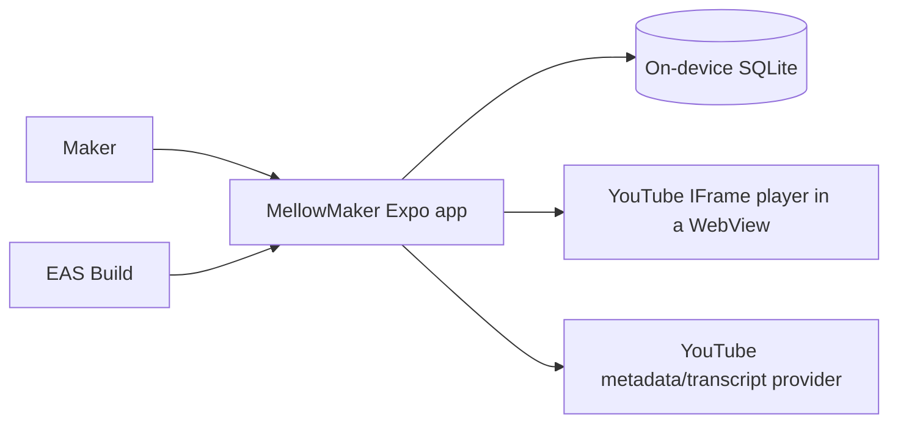

# MellowMaker Architecture

**Status:** Baseline architecture for PRD0  
**Source of truth:** [`vision.md`](./vision.md)  
**Applies to:** iOS and Android application delivered through Expo and EAS

## 1. Purpose

MellowMaker is an offline-first React Native application for crocheters. It combines a stitch dictionary, personal pattern management, interactive steps, persistent row/stitch counters, and structured guides imported from YouTube.

This document turns the product vision into technical boundaries. It intentionally avoids choosing libraries or services that the repository has not yet adopted. When the implementation establishes a convention, update this document in the same change.

## 2. Architectural drivers

1. **Offline-first core:** Stitch content, patterns, imported guide structure, notes, progress, and counters remain usable without connectivity.
2. **Local durability:** User-created data survives navigation, app restarts, and application upgrades.
3. **Cross-platform behavior:** The same product capabilities ship on iOS and Android from an Expo managed project.
4. **Fast interaction:** Counter taps and step completion update immediately and never wait for a network request.
5. **Safe evolution:** SQLite schema changes preserve existing maker data.
6. **Replaceable network integrations:** YouTube metadata and transcript capabilities are isolated from the local domain because provider behavior and availability can change.
7. **Playful, accessible UI:** Visual energy and animation must not compromise legibility, touch ergonomics, or accessibility.

## 3. System context

SQLite is the source of truth for core application state. Network services enrich imported guides and provide video playback; they are not dependencies for opening saved content or recording progress.

## 4. Technology baseline

| Concern | Baseline |
|---|---|
| Application | React Native with Expo managed workflow, SDK 52 or later |
| Language | TypeScript with strict type checking |
| Distribution | EAS builds for iOS (`.ipa`) and Android (`.aab`) |
| Local persistence | `expo-sqlite` `~57.0.1`, one application-owned database behind a synchronous connection boundary |
| Identifier generation | `expo-crypto` `~57.0.1` `randomUUID()`, injected into the data layer rather than imported by it |
| Bundled stitch content | One committed JSON document under `src/data/seed`, validated against one documented schema in the test suite and applied through `StitchRepository` |
| Video | YouTube plays through the **YouTube IFrame Player API in a WebView** (`react-native-youtube-iframe` `2.4.1` over `react-native-webview` `13.16.1`), added by issue #11 (see §9.1). `expo-video` stays in the stack only for possible future non-YouTube media. |
| Styling | NativeWind v4 |
| Motion | React Native Reanimated |
| Vector drawing | `react-native-svg` `15.15.4` — the version Expo SDK 57 bundles, so it autolinks and runs in Expo Go with no config plugin and no prebuild. Added by issue #46 for the stitch step drawings (see §10); `tests/reactNativeSvgPin.test.ts` holds the pin. |
| Platforms | iOS and Android |
| Navigation | Expo Router typed routes with Stitches, Patterns, and Guides bottom tabs |
| Transient state and forms | React hooks/context and controlled inputs with pure domain validation; no global store or form dependency |
| Unit/component tests | Jest with `jest-expo` and React Native Testing Library |
| SQL integration tests | In-memory `node:sqlite` using shared production SQL/migration inputs |
| Installed-app smoke tests | Maestro on iOS and Android targets |
| Long lists | React Native `FlatList` virtualization over bounded `Page` repository reads; no third-party list dependency |
| Network metadata | The platform global `fetch` + `AbortController` (no dependency), reached through a `GuideMetadataGateway` contract in `src/data/contracts` with the oEmbed adapter in `src/platform/network`; injected `fetch` keeps it testable offline (see §9.1). Resolved by issue #9. |

The generic network-client-library question stays open, but the **one** network
need PRD0 has — best-effort YouTube metadata — is resolved by issue #9 as the
platform global `fetch` with **no added dependency** (see §9.1); a heavier HTTP
client is introduced only if a later feature justifies it. Expo Router owns typed
navigation, while durable state remains SQLite-authoritative. React hooks own
local drafts, focus, loading, and animation; narrowly scoped context may provide
stable dependencies or cross-screen ephemeral coordination, but it must never
become a second durable entity store. Controlled forms trim, parse, and validate
through pure domain functions that return discriminated success or field-error
results. A state, form, or validation dependency should be introduced only when
later feature complexity justifies changing this recorded decision.

## 5. Application boundaries

The codebase should preserve these logical layers even if the initial folder structure is compact.

Source code follows these boundaries: `src/features/<feature>/presentation`
contains screens and feature orchestration; `src/domain` contains
platform-independent entities, use cases, and validation; `src/data` contains
repository contracts and SQLite or remote implementations; `src/platform`
contains Expo/native adapters; and `src/ui` contains reusable presentation and
theme code. Direct imports are lint-restricted so domain code cannot depend on
React, React Native, Expo, or higher layers; data code cannot depend on Expo,
React Native, routes, feature presentation, or UI, keeping SQL and mapping
engine-neutral and testable without a native runtime; and feature/UI code cannot
import anything from the concrete `src/platform` implementation root. Data
contracts intended for
feature/UI consumption live under `src/data/contracts`; all other `src/data`
paths are treated as concrete implementation paths. These restrictions resolve
the imported file before checking its layer, so aliases and relative paths have
the same boundary.

### 5.1 Presentation

Screens, navigation, accessible controls, and visual states. Presentation code may call feature use cases but must not construct SQL or depend directly on a remote provider.

Expected product areas:

- Stitch dictionary and stitch detail
- Pattern library and pattern editor
- Active pattern viewer with checklist and counter
- YouTube import flow and imported guide viewer

### 5.2 Feature/domain

Owns product behavior and platform-independent types:

- searching and reading stitch guides;
- creating, editing, ordering, and deleting patterns and steps;
- completing or reopening steps;
- incrementing, correcting, and resetting counters;
- parsing supported YouTube URLs;
- creating and editing timestamped guide steps;
- coordinating import results with local persistence.

Domain behavior must not depend on React component lifecycle or a network connection.

`src/domain` exists as of the stitch dictionary. It holds the rules that both
`src/data` and a feature need to agree on, and nothing else: today that is
`stitches/stitchQuery.ts`, the one definition of what a maker's typed query
means, so the repository and the dictionary screen cannot disagree about
whether a query is blank. Lint enforces the direction — `src/domain` may not
import `@/app`, `@/features`, `@/data`, `@/platform`, `@/ui`, React, or Expo,
while `src/data` may import `src/domain`.

### 5.3 Data access

Repositories are the only feature-facing boundary to SQLite. They own queries, transactions, row-to-domain mapping, and write ordering. UI components must not contain SQL.

Remote YouTube access sits behind a separate gateway. Provider response objects are mapped into MellowMaker-owned types before reaching feature code, preventing third-party payload changes from leaking throughout the app.

### 5.4 Platform infrastructure

Contains Expo/native adapters: the `expo-sqlite` connection and the composition
of the opened, migrated app database, the YouTube IFrame player WebView (and the
`expo-video` integration reserved for future non-YouTube media),
connectivity-aware network calls, and EAS/app configuration. Schema and
migrations are engine-neutral and live with the repositories in `src/data`, so
the platform layer holds no SQL. Platform differences should remain behind
narrow interfaces where practical.

## 6. Data model

Schema version 1 is the whole PRD0 schema and version 2 adds bundled-pattern
provenance and the pattern seed ledger (issue #44), both defined in
`src/data/sqlite/migrations.ts`. That module is the single source of schema truth
for the Expo adapter and for the `node:sqlite` integration tests, and it imports
nothing.

| Table | Responsibility | Key relationships |
|---|---|---|
| `stitch` | Identity, name, abbreviation, difficulty, summary, ownership provenance, and a normalized `search_text` | parent of `stitch_instruction` |
| `stitch_instruction` | Ordered instruction text and local image asset key | `stitch_id` → `stitch`, cascade |
| `pattern` | Project metadata, notes, and `origin` provenance (`bundled`/`user`) | parent of steps, progress, counters |
| `pattern_seed_state` | Durable slug-to-pattern seed ledger: which slugs the pattern seed has already inserted. `seed_version` is re-stamped on every apply, so it records the **highest release applied**, not the release that first inserted the slug | `pattern_id` -> `pattern` **set null** |
| `pattern_step` | Ordered row/instruction text for one pattern | `pattern_id` → `pattern`, cascade |
| `pattern_progress` | One row per pattern holding the active position | `pattern_id` → `pattern` cascade; `active_step_id` → `pattern_step` **set null** |
| `pattern_step_progress` | One row per step holding its `completed_at` instant | `step_id`/`pattern_id` cascade |
| `imported_guide` | Canonical YouTube identity (`video_id` unique), URL, title, creator, thumbnail, notes, metadata sync instant | parent of guide steps and counters |
| `guide_step` | Ordered instruction, optional `video_offset_ms`, transcript excerpt, note, completion, and `origin` | `guide_id` → `imported_guide`, cascade |
| `counter` | Durable count, kind, maker label, and position for exactly one owner | `pattern_id` or `guide_id`, cascade |

**PRD0 decision 3 is resolved: one maker-labelled counter per project** (issue
#7), not separate row and stitch counters. The working view surfaces exactly one
counter the maker can name (default label **"Rows"**, `kind = 'custom'`),
obtained through the idempotent owner-keyed accessor
`CounterRepository.getOrCreatePrimaryCounter(owner)`: it returns the owner's
existing counter or, on first call, inserts one at position 0 inside a
transaction, so a mount, refresh, or reopen never creates a second row.
`renameCounter(id, label)` rewrites the maker label (the caller passes an
already-normalized, non-empty label from `src/domain/counters/counterLabel.ts`,
the shared rule so the repository default and the presentation rename cannot
disagree) and leaves the value untouched. **The single-counter choice is
enforced at the accessor and the UI, not by a new schema constraint** — the
`counter` table still permits many counters per owner, so a future *deliberate*
multi-counter decision or the guide counters (#10/#11, `owner_kind = 'guide'`)
need no migration. The trade-off is that there is no DB-level "one row per
pattern" guarantee; the idempotent accessor plus the fact that the UI never
calls `createCounter` keeps exactly one in practice, and a repository test pins
the invariant. Issue #7 shipped no migration; the schema was still at
version 1 then, and `counter` is unchanged by version 2.

`pattern_progress` is deliberately split in two: one row per pattern for the
active position and one row per step for completion. Each has a single job, both
cascade cleanly, and a viewer restores position and completion with two bounded
reads.

**Guide authoring and completion (issue #10) ship with no migration.** Structured
guide authoring, the offline working view, and the guide counter reuse the
version-1 schema unchanged: `guide_step` already carries instruction, optional
`video_offset_ms`, `transcript_excerpt`, `note`, `completed_at`, `origin`, and a
contiguous `position`, and `counter` already carries the `owner_kind = 'guide'`
owner and its `guide_id` FK, so issue #10 added no migration and no dependency
(the schema was still at version 1 then). Guide steps follow the same conventions as
pattern steps: an append lands at `position = current step count`, a delete
re-compacts the remainder to `0..n-1`, and a reorder validates exact membership
then runs the two-pass `reorderPositions` under `UNIQUE (guide_id, position)`.
Guide **completion is the per-step `guide_step.completed_at` instant**, written by
one absolute statement (`completed_at = now()` or `NULL`, no read-modify-write);
it deliberately does **not** bump `imported_guide.updated_at`, because completion
is working state and must not churn library recency — the same stance as pattern
completion living in a separate table. Unlike a metadata refresh, a deliberate
`updateGuideDetails` **does** rewrite the maker's title (and notes).

**Guides derive current/next and store no active pointer.** A guide has **no
`guide_progress` table** and #10 adds none (that would be a migration). The guide
working view reuses the pure `resolvePatternProgressView` with
`activeStepId: undefined`, so **current is always the first incomplete step**;
completing an out-of-order step never moves current (first-incomplete is
unchanged). The consequence is deliberate: guides have no persisted "Work on step
N" selection like the pattern viewer, only completion state and the derived
place. Timestamps are display/authoring only in #10; **issue #11 makes a
timestamped step badge a button that seeks the player** (§9.1).

The interactive pattern viewer (issue #6) reads these two tables and derives the
maker's place rather than storing it. Completion is the per-step `completed_at`
instant; the maker's position is the single `pattern_progress.active_step_id`.
The **current/next step is computed, never stored** (`src/domain/patterns/patternProgress.ts`):
it is `active_step_id` when that names an existing *incomplete* step, else the
first incomplete step by position, else none ("pattern complete"). Completing the
current step auto-advances `active_step_id` to the next incomplete step (or clears
it), so the restored position matches where the maker will work next; completing
an out-of-order step never moves the pointer. There is **no** scroll/offset
column — "viewing position" is the active step scrolled into view, and precise
scroll restoration is a presentation concern, not persisted state.

Conventions every table follows:

| Rule | Decision |
|---|---|
| Identity | `id TEXT PRIMARY KEY` holding a generated v4 UUID. Never a name, slug, or list position. |
| Timestamps | `INTEGER` milliseconds since the Unix epoch, UTC, in a column whose name ends in `_at`. One unit everywhere. |
| Calendar dates | A wall-clock date stores ISO-8601 `YYYY-MM-DD` `TEXT`. Version 1 has no such column; every temporal value is an instant. Conversion to local time happens only in presentation. |
| Ordering | Explicit `position INTEGER NOT NULL CHECK (position >= 0)`, contiguous from 0 within its parent, `UNIQUE (<parent>_id, position)`. Reads always `ORDER BY position ASC, id ASC`. |
| Recency | `pattern` has no manual position; the library orders by `updated_at DESC, id ASC` through `pattern_recent_idx`. Manual positions exist only where the maker reorders: stitch instructions, pattern steps, guide steps, counters. |
| Booleans | Not stored. Completion is a nullable `completed_at` instant, so "when" is never lost. |
| Deletion | Every child of an aggregate root is `ON DELETE CASCADE`. Exactly two columns are `ON DELETE SET NULL`, both deliberately. `pattern_progress.active_step_id`, so deleting one step clears the pointer instead of destroying the pattern's progress. `pattern_seed_state.pattern_id` (version 2), so the ledger row **outlives the pattern it created**: if a cascade removed it, the next launch would see an unledgered slug and resurrect a bundled pattern the maker deliberately deleted. `ON UPDATE` is omitted because identifiers are immutable. |
| Ownership | Two different marks for two different jobs. `stitch.ownership` (`seed`/`user`) with `stitch.seed_version` and `stitch.user_modified_at` governs **seed write authority**: a stitch release may insert or update only rows where `ownership = 'seed'` and `user_modified_at IS NULL`. `pattern.origin` (`bundled`/`user`) records **provenance only** and grants the seed nothing, because a bundled pattern is fully maker-owned from the instant it lands - it is freely editable, reorderable, and deletable, so there is no `user_modified_at` on `pattern` and nothing ever asks whether the maker has edited one. A maker-created pattern is always written `'user'` explicitly, which makes "a maker can never create a bundled pattern" structural. `imported_guide` and its children stay unmarked and are always maker-owned. |
| Search | `stitch.search_text` is a stored generated column, `lower(trim(name)) \|\| ' ' \|\| lower(trim(abbreviation))`, indexed, so case- and whitespace-insensitive lookup cannot drift from its source columns. `StitchRepository.searchStitches` matches it with two token-prefix `LIKE ? ESCAPE '\'` clauses — `q%` and `% q%` — so an abbreviation matches as a whole token (`dc` never returns *Half double crochet* through `hdc`), a multi-word name still matches across its space, and the first clause stays index-eligible. `%`, `_`, and `\` a maker typed are escaped at that boundary rather than stripped during normalization, and results are ordered `search_text ASC, id ASC` like browse. No FTS table, no dependency, no migration. |
| Exclusive owners | `counter.owner_kind` plus paired `CHECK`s guarantee exactly one pattern or one guide owner. `UNIQUE (pattern_id, position)` and `UNIQUE (guide_id, position)` order each owner independently because SQLite treats `NULL`s in a unique index as distinct. |
| Cross-parent references | A reference that must stay inside one aggregate derives its parent in SQL rather than trusting the caller. `pattern_progress.active_step_id` and `pattern_step_progress.pattern_id` are both written by `INSERT ... SELECT ... FROM pattern_step WHERE id = ?`, so a step from another pattern — or no step at all — writes nothing instead of pointing a pattern at a position it does not own. |
| Text | Trimmed by the caller before insert; the schema never trims silently except in the generated search column. |

### 6.1 Seed content

Two bundled content sets follow the same convention - a committed JSON document,
one module that *is* its documented format, and a loader with a version guard -
and diverge on exactly one point: the stitch seed revises in place, the pattern
seed only ever inserts. `createAppDatabase` applies the stitch seed and then the
pattern seed, so `DatabaseGate`'s ready state means migrated *and* both content
sets seeded.

#### Bundled stitch content

Bundled stitch content is one committed JSON document,
`src/data/seed/stitchSeed.json`, holding a document-level `seedVersion`, an
in-band `"terminology": "US"` declaration, and the records themselves. It lives
in `src/data` because that layer owns bundled data and the repository contract;
`src/domain` may not import `@/data/*`, and feature/UI code already cannot reach
a non-contract `src/data` path. JSON rather than a TypeScript literal keeps
shipped content as data validated at a boundary.

`src/data/seed/stitchSeedDocument.ts` is the one documented format. Its
`parseStitchSeedDocument` returns a discriminated result and collects every
issue, so a malformed record is a red gate rather than shipped content, and the
committed document is validated in the test suite on every run.

| Concern | Decision |
|---|---|
| Seed identity | The kebab-case `slug` is frozen at authoring time. A release is matched by slug, so a changed slug would insert a duplicate stitch. `stitch.id` stays a v4 UUID assigned on first insert and never rewritten, so later references survive content revisions. |
| Version | One monotonically increasing integer per document, never per record, stamped onto every row a release touches. |
| Launch guard | `StitchRepository.appliedSeedVersion()` reads `MAX(seed_version)` over seeded rows. An equal or higher applied version skips the import, so relaunch performs one bounded aggregate and no writes, and an older build cannot rewrite newer content — the same refusal stance as `unsupported-schema-version`. `MIN` would re-import forever once a maker edited one row. |
| Revision, not deletion | A release may add or revise records in place. No seed delete path exists in the contract, because retiring a bundled stitch would strand a maker who relies on it. |
| Maker data | The repository's `ownership = 'seed'` and `user_modified_at IS NULL` filter is the only write path, so a release never overwrites a maker edit or a maker-owned stitch. |
| Invocation | `createAppDatabase` applies the bundled content after migrations, inside its existing `try`. `DatabaseGate`'s ready state therefore means migrated *and* seeded, so dictionary screens own no seeding state, and a seed failure reuses the existing rollback-and-retry path. |
| Error taxonomy | `StitchSeedError` is deliberately outside `DatabaseError`'s four codes: invalid bundled content is not a database condition. The gate maps it to its unexpected-error state and offers a retry, and the committed content gate makes that state unreachable in a shipped build. |

#### Bundled pattern content

Bundled pattern content is `src/data/seed/patternSeed.json` - six original
beginner patterns (issue #44) with a document-level `seedVersion`, an in-band
`"terminology": "US"` declaration, and plain-string steps whose array index
becomes `pattern_step.position`. `src/data/seed/patternSeedDocument.ts` is its one
documented format, mirroring the stitch parser's collecting discriminated result.

| Concern | Decision |
|---|---|
| Seed identity | The kebab-case `slug` is frozen at authoring time and is the key of `pattern_seed_state`. `pattern.id` is a v4 UUID assigned on insert. The `pattern` table itself carries no slug: identity for the seed lives in the ledger, not on the maker's row. |
| Version | One monotonically increasing integer per document, never per record. `insertSeededPatterns` stamps **every** ledger row to the applied release at the end of the run, including rows it skipped, so a bump that adds no new slug still moves the guard and is not re-attempted on every relaunch. A row's `seed_version` therefore answers "what is the highest release this database has applied", never "which release introduced this slug" - nothing records the latter, and nothing needs it. |
| Launch guard | `PatternRepository.appliedPatternSeedVersion()` reads `MAX(seed_version)` over **`pattern_seed_state`**, never over the pattern rows. Reading it from the rows - the way the stitch guard reads `stitch` - is the resurrection bug: a maker who deleted every bundled pattern would drive the aggregate to `NULL` and get all six back on the next launch. The guard is only the fast path; the per-slug ledger check inside `insertSeededPatterns` is the actual mechanism, and it deliberately never consults the `pattern` table. |
| Revision policy | **Insert-only. The pattern seed never updates and never deletes.** A slug the ledger records is skipped whether the maker still has the pattern, has retitled and reordered it, or has deleted it. A bundled pattern becomes the maker's property on insert - they may be mid-project on it with completion rows, an active-step pointer, and a counter - so a release that rewrote its text would destroy live work and could orphan `pattern_progress.active_step_id`. A bumped version may therefore add **new slugs only**. This is the deliberate divergence from the stitch seed. |
| Recency anchoring | `insertSeededPatterns` reads `MIN(updated_at) FROM pattern` **once, before the loop** (or `now()` on an empty library) and writes record *i* at `anchor - 1 - i`. The six instants are strictly distinct and strictly descending, so document order is the fresh-install library order; and because they sit below the oldest existing row, the starters never push a maker's in-progress project down the library. A per-insert `now()` would tie the rows within one millisecond - random order on every install - and float them above the maker's own work. |
| Maker data | No write path touches a pattern the seed did not create in that same call. There is no seed update statement and no seed delete statement anywhere in the repository module. |
| Invocation | `createAppDatabase` calls `applyBundledPatternSeed` immediately after the stitch seed, inside the same `try`, so a failure rolls its transaction back and reuses the gate's retry. |
| Error taxonomy | `PatternSeedError` sits outside `DatabaseError`'s four codes for the same reason `StitchSeedError` does; the gate maps it to its unexpected-error state. |

Presentation is unchanged by bundled patterns: the library renders whatever
`listPatterns()` returns, and there is deliberately **no badge, filter, or visual
distinction** for a bundled row (a mark on a pattern the maker can freely
retitle, reorder, and delete would be noise). `origin` is carried on
`PatternSummary` so a later deliberate decision needs no migration. The "No
patterns yet" empty state remains implemented and correct - it is now reached
only after a maker clears their library rather than on first launch.

The approval, authorship, imagery, attribution, and update-policy record for both
sets is [`content-provenance.md`](./content-provenance.md) (sections 2-7
stitches, sections 8-11 patterns).

## 7. SQLite lifecycle

1. **One connection.** `src/platform/database/expoSqliteConnection.ts` opens
   `mellowmaker.db` once with `SQLite.openDatabaseSync` (the cached default
   connection), sets `PRAGMA journal_mode = WAL`, and adapts the synchronous
   `expo-sqlite` API to `SqliteConnection` — the one engine-neutral SQL surface
   every data module uses. `getFirstSync`'s `null` becomes `undefined` so callers
   have a single absent value. WAL is set only in the platform adapter, because it
   is a property of the real file rather than of the in-memory test harness.
2. **Foreign keys.** `initializeDatabase` runs `PRAGMA foreign_keys = ON` outside
   any transaction (the pragma is a no-op inside one), reads it back, and throws
   `DatabaseError('foreign-keys-unavailable')` unless it reports `1`.
3. **Version.** `PRAGMA user_version` is the authoritative integer schema version.
   It lives in the file header and is transactional with the migration that sets
   it, so it cannot desync from the schema. A version above the latest known
   migration throws `DatabaseError('unsupported-schema-version')` and touches
   nothing: a downgraded app must never rewrite a newer database.
4. **Migrations.** Pending migrations run in ascending version order, each inside
   one `BEGIN IMMEDIATE` transaction that ends by setting `PRAGMA user_version`.
   `BEGIN IMMEDIATE` takes write intent up front. Pragmas cannot be
   parameterized, so the version is interpolated after `Number.isInteger`
   validation; this is the single documented exception to parameterized SQL and it
   never touches maker input.
5. **Failure.** SQLite keeps DDL and `user_version` inside the transaction, so a
   failed migration rolls back schema, rows, and version together and raises
   `DatabaseError('migration-failed')` carrying the current and failing versions.
   There is no `DROP`, no delete-and-recreate, and no reset control anywhere.
   Re-running initialization after a failure is safe and resumes from the last
   good version.
6. **Error taxonomy.** `DatabaseError` (in `src/data/contracts`) carries exactly
   `open-failed`, `foreign-keys-unavailable`, `migration-failed`, and
   `unsupported-schema-version`. Its messages carry codes and version numbers
   only, never maker content.
7. **Upgrade coverage.** Every future schema change appends a migration and ships
   its own populated fixture case that asserts literal maker rows survive.
   `LATEST_SCHEMA_VERSION` is **2**. Migration 2 (issue #44) adds
   `pattern.origin TEXT NOT NULL DEFAULT 'user' CHECK (origin IN ('bundled','user'))`
   - the default is what backfills every pattern an installed version-1 database
   already holds - and creates `pattern_seed_state`. Its populated upgrade
   fixture is the "upgrades a populated version-1 database to version 2 without
   losing maker data" case in `tests/databaseInitialization.test.ts`, which
   starts from `MIGRATIONS.filter(m => m.version === 1)` plus
   `insertPopulatedBaseline`, then asserts literal titles, notes, step order, the
   active pointer, the completion instant, the guide step's offset and note, the
   counter at 7, `origin = 'user'` on every pre-existing row, and an empty
   ledger.
8. **What migration 2 established for migration 3.** #44 was the repository's
   first real migration. Five of its choices are conventions to reuse rather than
   one-offs:
   - **The populated fixture is a column-naming helper, not a snapshot of the old
     schema.** `tests/support/populatedBaseline.ts` names every column in every
     insert, so the same helper is valid against version 1 and version 2
     unchanged, and stays valid at 3. A fixture written as
     `INSERT INTO pattern VALUES (...)` would have to be forked per version.
     Extend the helper; do not copy it.
   - **The upgrade case starts from the production `MIGRATIONS` array**, filtered
     to the previous versions (`MIGRATIONS.filter(m => m.version === 1)`), never
     from a hand-written DDL copy of the old schema. The previous schema under
     test is then by construction the one the app actually shipped.
   - **Backfill in the DDL where the column allows it.**
     `ADD COLUMN ... NOT NULL DEFAULT 'user'` backfills every existing row inside
     the same migration transaction; a follow-up `UPDATE` would add a second
     failure point for the same outcome. The plan verified the exact statement
     against `node:sqlite` *before* prescribing it, which is what made the
     backfill claim reviewable rather than hopeful — do that too.
   - **Version state that must outlive its rows belongs in its own table.** The
     stitch seed derives its applied version from the seeded rows; the pattern
     seed cannot, because a maker can delete every one of them. Any future seed
     whose rows the maker can delete needs a ledger read with `MAX` over the
     ledger and an `ON DELETE SET NULL` tombstone - never an aggregate over its
     own output.
   - **Synthetic migration cases derive from `LATEST_SCHEMA_VERSION + 1`**, so
     bumping the version does not require editing them.

Repositories are built by `createRepositories` over one `RepositoryContext`
(connection, transaction runner, injected clock, injected identifier generator),
so `src/data` never imports Expo and tests stay deterministic. Multi-record
operations — creating a pattern with steps, saving an imported guide, applying a
seed release, reordering — run in one transaction; nested calls use savepoints so
one repository method can compose another. Because the SQL API is synchronous and
shared, a read-modify-write cannot interleave; counter and completion writes
additionally use one statement (`MAX(0, value + ?)` and an `ON CONFLICT` upsert)
so rapid interaction cannot lose an update. Reordering under
`UNIQUE (<parent>_id, position)` runs two passes inside one transaction — offset
every affected row, then write final positions — because SQLite cannot defer a
unique constraint. List reads are bounded by `Page` (default 50, hard cap 200).

Data-dependent UI is gated: `src/ui/database/DatabaseGate.tsx` takes an
`initialize` function typed only by `src/data/contracts`, owns an
`initializing`/`ready`/`failed` state machine, publishes the repositories through
narrow context, and renders children only when ready. `src/app/_layout.tsx` is the
composition root and the only place that references `src/platform`.

## 8. Offline and synchronization model

PRD0 has no account or cloud synchronization requirement. SQLite is authoritative.

| Capability | Offline behavior |
|---|---|
| Browse/search stitch dictionary | Fully available |
| Open/edit personal patterns | Fully available |
| Complete steps and use counters | Fully available and persisted immediately |
| Open saved imported guide text/steps | Fully available |
| Play a YouTube video | Network may be required; show an explicit unavailable state |
| Import or refresh YouTube metadata/transcript | Network required; failure must not alter an existing saved guide |

An import should stage and validate remote data before committing it locally. A failed refresh must leave the last saved guide usable. PRD0 does not download YouTube media for offline playback.

The offline-first core is a **test-enforced boundary** (issue #12). Cold start, the bundled seed, and every core read/write path — dictionary, patterns, step progress, counters, and saved-guide text — reference no network gateway or `fetch`. This is pinned by `tests/offlineColdStart.test.tsx`: a behavioural airplane-mode cold start that runs the real migrations plus a populated baseline and exercises each core flow with the global `fetch` stubbed to throw, asserting it is never called, and a static import guard asserting the enumerated core modules match no network token while the two allowlisted feature files (`useGuideImport`, `useGuideEditor`) do. The guard complements the layer lint (`scripts/check-architecture-boundaries.js`): the lint stops `src/data`/`src/domain` importing `src/platform`, but feature presentation may legitimately import the metadata gateway, so the guard is what pins the *feature* core paths. This issue resolves no new open architectural decision — the migration-failure contract (visible, non-destructive, retry-only, never resets or wipes) is already recorded in sections 7.5 and 12.

## 9. YouTube integration

The importer has four separate responsibilities:

1. **URL parsing:** Normalize supported YouTube URL forms into a canonical video identifier.
2. **Enrichment:** Fetch the available title, thumbnail, and creator name through a provider adapter - the key-free oEmbed lookup of §9.1, which is the app's only sanctioned network call. No transcript, caption, chapter, or description is ever fetched (§9.1, §9.2); the owned metadata type has no transcript field.
3. **Guide authoring:** Let the maker create or edit timestamped steps and instruction text regardless of transcript availability.
4. **Step derivation from maker-pasted text:** Turn text the *maker* copied out of YouTube — a description chapter list, or transcript-panel cues — into a reviewable draft of timestamped steps the maker confirms. The app never fetches this text (§9.2).

Automatic transcript extraction or structured breakdown is optional when no compliant, reliable provider is available; manual timestamped guide creation is the required fallback. Provider credentials must never be embedded in the client bundle. Introducing a server-side credential proxy is a separate architectural decision, not an implicit part of the mobile app.

Remote titles, creator names, thumbnails, and transcript text are untrusted input. Validate payload shape, constrain displayed content, and never execute imported text.

### 9.1 Compliant sources — resolved (issue #8)

Issue #8 resolved the compliant source model for all three responsibilities
(PRD0 decisions 5 and 6). Two non-negotiable constraints govern every choice: no
design may **scrape or reverse-engineer YouTube media URLs**, and no design may
**embed a private credential in the client bundle** (AC #5; NFR-11/13). The
following is the recorded architecture; playback is implemented in #11 and URL
parsing in #9.

**Implemented in issue #9 (URL identity + metadata).** The URL matrix below is
implemented as the pure `src/domain/guides/youtubeUrl.ts` normalizer, extended to
also accept the two legacy/compliant forms the original table omitted —
`youtube.com/v/ID` (legacy embed path) and `youtube-nocookie.com/embed/ID`
(privacy-enhanced domain), both normalizing to the same bare 11-char id. Metadata
is the oEmbed path below, realized as a MellowMaker-owned `GuideMetadataGateway`
contract (`src/data/contracts`) whose oEmbed adapter lives in
`src/platform/network/youtubeOembedGateway.ts` and uses the injected platform
global `fetch` (**no dependency added**); a pure `mapOembedResponse` shape-checks
the provider payload into owned types at the boundary, keeps only the four safe
string fields, and **never returns the provider `html`** — the owned type has no
`html` and no transcript field, so neither can be rendered or claimed. The gateway
is surfaced to features through a narrow `src/ui/guides` context wired at the
composition root. A guide is deduplicated on `imported_guide.video_id UNIQUE`; a
refresh updates provider display fields only, never the maker's title and never a
`guide_step`, and a failed fetch performs no write.

**URL matrix and canonical identity (FR-YT-02/03).** Every supported form carries
an 11-character video id matching `[A-Za-z0-9_-]{11}`. Normalization extracts that
id and **discards everything else** (playlist, timestamp, tracking params); the
canonical identity is the bare id (`imported_guide.video_id`, unique), so the same
video pasted in any form never duplicates. Validation is a pure function—no
network needed—so it is unit-testable at the narrowest level (NFR-16).

| Input form | Example | Canonical id |
|---|---|---|
| `watch?v=` | `https://www.youtube.com/watch?v=dQw4w9WgXcQ` | `dQw4w9WgXcQ` |
| short link | `https://youtu.be/dQw4w9WgXcQ` | `dQw4w9WgXcQ` |
| Shorts | `https://www.youtube.com/shorts/dQw4w9WgXcQ` | `dQw4w9WgXcQ` |
| embed | `https://www.youtube.com/embed/dQw4w9WgXcQ` | `dQw4w9WgXcQ` |
| live | `https://www.youtube.com/live/dQw4w9WgXcQ` | `dQw4w9WgXcQ` |
| with extra params | `https://youtu.be/dQw4w9WgXcQ?t=42&si=abc` | `dQw4w9WgXcQ` (params dropped; `t` may seed a step timestamp but is not part of identity) |
| watch + playlist | `https://www.youtube.com/watch?v=dQw4w9WgXcQ&list=PLxxxx` | `dQw4w9WgXcQ` (playlist ignored) |
| host variants | `m.youtube.com`, `music.youtube.com`, `www.`/no-`www.`, `http`/`https` | normalize host, then as above |

Input is **rejected with an actionable message** (FR-YT-02) when it is a
non-YouTube host, a YouTube URL with no extractable 11-character id (for example a
channel `/@handle`, a playlist-only `?list=` with no `v=`, or `results?search_query=`),
or any candidate id that fails the `[A-Za-z0-9_-]{11}` shape.

**Metadata — YouTube oEmbed (FR-YT-04/05/06).** Metadata comes from
`GET https://www.youtube.com/oembed?url=<encoded watch url>&format=json`. It is a
fully public endpoint with **no API key or credential**, so it satisfies the
no-secret constraint with no proxy and no offline-first violation. Fields used:
`title`, `author_name`, `author_url` (creator), `thumbnail_url`. The `html`/
`width`/`height` embed snippet is **not executed**—all fields are treated as
display-only untrusted text, shape-validated, never rendered as markup or code
(FR-GU-07, NFR-12). It is unofficial-but-public with no documented SLA or
rate-limit, so any non-200, timeout, private/removed/age-restricted video, or
malformed body is treated as "metadata unavailable": fields stay blank and
editable and manual guide creation proceeds (FR-YT-05/06, FR-DA-05). A failed
refresh must not overwrite locally edited fields or duplicate steps (FR-YT-07).
The keyed **YouTube Data API v3** (`videos.list`) is **rejected for the client**
because it requires an API key—exactly the embedded secret AC #5 / NFR-11/13
forbid; doing it compliantly would need a trusted server holding the key, a
backend PRD0 excludes.

**Transcripts — optional / manual only (FR-YT-08, FR-GU-08).** No compliant public
API returns transcripts for arbitrary videos: the Data API `captions.download`
requires OAuth from the video's owner and cannot read arbitrary or auto-generated
captions, and popular "transcript API" libraries scrape YouTube's internal
`timedtext` endpoint (non-compliant and brittle). Transcript support therefore
ships as an **optional manual field**—a maker-entered excerpt or note per step—and
the app never claims a transcript exists when none was provided. This is the only
PRD0 path; no scraping dependency is added. Issue #45 later widened how that field
is *populated*—the maker may paste text they copied out of YouTube themselves
instead of retyping it (§9.2)—but it did **not** widen what the app retrieves:
this "no compliant source, the app fetches nothing" finding is unchanged and
still governs.

**Playback — YouTube IFrame Player API in a WebView (FR-GU-04, FR-GU-06).**
Recorded blocking evidence for AC #4: `expo-video` plays a `VideoSource` pointing
at a **direct media file or stream** (progressive `mp4`, HLS, DASH); it is not a
YouTube player and has no YouTube support, and the only way to feed a YouTube
video into it is a direct media-stream URL obtainable only by scraping—prohibited.
Compliant YouTube playback through `expo-video` is therefore **not feasible**, and
the approved product revision (recorded in `docs/vision.md` and `docs/prd0.md` §5
with the owner's approval) plays YouTube inside **YouTube's own official IFrame
player, rendered in a WebView** via `react-native-youtube-iframe` over
`react-native-webview`—both Expo-managed-workflow compatible (NFR-07). It plays
within YouTube's player (no ToS violation) and exposes `seekTo(seconds)`, exactly
what FR-GU-04 needs. When online it embeds above the timestamped steps; when the
video is unavailable or offline it degrades to a **link-out to the YouTube app**
plus the saved steps and progress read from SQLite (FR-GU-06). The WebView and any
player subscription are released on view teardown (NFR-10). These offline-first
guarantees are unchanged: saved guide text, steps, and progress never depend on
the network. `expo-video` remains in the stack only for possible future
first-party/self-hosted media.

**Dependencies (added by issue #11).** `react-native-webview` `13.16.1` (the
version Expo SDK 57 pins in `bundledNativeModules.json`; native module,
autolinked, no config plugin) and `react-native-youtube-iframe` `2.4.1` (pure JS
wrapper over the WebView; no native code of its own, peer `react-native-webview
>=7` satisfied). Both resolve via autolinking, so **no `app.json` config plugin or
prebuild change** is required. These are the project's first two runtime
dependencies; nothing else — and no `expo-video` — was added. Jest **mocks
`react-native-youtube-iframe`** (a `forwardRef` stub exposing a `seekTo` spy) so
the suites run without a real WebView; no `transformIgnorePatterns` change is
needed. The on-device proving spike (a canonical id renders and seeks on iOS and
Android under EAS, with the offline link-out fallback) remains an on-device check,
logged in `docs/runbooks/smoke-verification.md`.

**Player seam — filled by issue #11.** Issue #10 shipped the guide working view
with the video region as a `GuidePlayerPlaceholder` seam (a 16:9 card + "Open in
YouTube" link-out) marked `TODO(#11)`. Issue #11 fills that seam: a
`GuideVideoPlayer` component, driven by a `useGuidePlayer(videoId)` hook, mounts
YouTube's IFrame player at the seam, keyed to the guide's canonical `videoId`, as
a **sibling above the always-rendered step list**. It **never gates, wraps, or
disables the instructions** — the saved steps, completion, counter, and progress
stay fully readable and interactive in every player state, offline included
(FR-GU-06). The player runs a text status machine: `loading` (a polite
"Loading video…" live region) → `ready` (the embedded player) → `error`. On
`error` the WebView is torn down and the widened `GuidePlayerPlaceholder` renders
the reason text mapped from the player's `onError` reason
(`video_not_found`/`embed_not_allowed`/connectivity default), a "Try again", and
the "Open in YouTube" link-out. **Seek (FR-GU-04):** a timestamped step's badge is
a button that calls `useGuidePlayer.seekToMs(ms)`, which seeks
`seekTo(videoOffsetMsToSeconds(ms), true)` — the pure, absolute
`videoOffsetMsToSeconds(ms) = max(0, ms)/1000` conversion (e.g. `42000 → 42`) —
**only when `ready`**; before ready, after error, or after unmount it is a guarded
no-op, so the instructions are never blocked. **Lifecycle (NFR-10 / AC#4):** the
player is released on **blur, not only on unmount** — `GuideWorkingViewReady`
drives `useGuidePlayer.release()` from `useFocusEffect`'s blur cleanup and
`resume()` from its focus body. Because guide routes are flat, hidden bottom-tab
screens, navigating away via the `canGoBack()===false` `replace('/guides')`
fallback leaves the view **mounted** (only blurred); a purely unmount-tied release
would leave the WebView running off-screen. On blur a `live` ref flips false
(suppressing any in-flight `onReady`/`onError`/seek), the player ref is nulled, and
the component unmounts the `<YoutubePlayer>` (real native WebView teardown); on
focus it re-arms and remounts for a fresh load. **Retry (AC #3):** `retry()` returns the machine to `loading`
and bumps a remount key only — it reads and writes **no** repository, so recovery
can never duplicate or mutate local guide data. No implementation scrapes or
reverse-engineers YouTube media URLs — playback is purely the sanctioned IFrame
embed of `videoId` (AC #5).

### 9.2 Guide steps from maker-pasted text — resolved (issue #45)

Issue #45 resolved how a YouTube guide becomes usable steps. Before it, a guide
was a video identity plus hand-typed steps: `useGuideImport.createGuide` calls
`guides.saveImportedGuide({ guide, steps: [] })` — literally an empty array — so
`docs/vision.md` §3C's "structured breakdown" had no implementation. The approved
model is **step derivation from text the maker pastes**, implemented in **#50**.

**The app fetches nothing.** §9.1's constraint is unchanged and absolute: the only
sanctioned network call remains the key-free oEmbed lookup. Transcripts, captions,
chapters, and descriptions are never retrieved by MellowMaker — no API, no
scraping, no `timedtext`. What changes is only that the app will *accept* such
text when **the maker** selects it in YouTube's own UI, on a page they are
lawfully viewing, and pastes it into their own local guide. The app performs no
access, no automation, and no reproduction of its own, and the text never leaves
the device (NFR-13). This is materially the same content FR-GU-03 already lets a
maker type by hand; accepting a paste changes the ergonomics, not what is stored.

**Description chapters are the primary source; transcript cues are the fallback.**
Both are accepted behind **one auto-detecting paste field** — the maker is never
asked to choose a mode. Two research findings drive that ordering:

- A caption transcript is **not a step list**. YouTube's "Show transcript" panel
  emits caption *cues* of roughly 2–6 seconds, split mid-phrase; a 20-minute
  tutorial yields on the order of 300–600 of them. Emitting one step per cue
  would produce hundreds of fragments — worse than the empty list, and a breach
  of NFR-09's bounded lists. Cues must therefore be **merged** into coarse blocks
  that the maker curates, which is exactly the "optional breakdown, manual
  authoring is the required fallback" stance of FR-GU-08.
- **Chapter timestamps in the video description are creator-authored and
  semantic.** YouTube's chapter rules require the first timestamp to be `00:00`,
  at least three timestamps in ascending order, and a ten-second minimum per
  chapter — so a description that reads `0:00 Materials / 1:12 Magic ring /
  2:40 Round 1` already *is* a step list, with a meaningful label and a working
  seek target per entry, at 3–30 steps rather than 400. It needs almost no
  heuristics.

Platform reality reinforces the ordering: the transcript panel is a **web-only**
feature and does not exist in the YouTube iOS/Android app, whereas the
description is ordinary long-press-selectable text right there in the app.
On the platform MellowMaker actually ships, pasting the description is a
realistic gesture and pasting the transcript is a chore.

**Retention: only the derived steps are stored — never the raw paste.** The
pasted blob is transient input; the artefact is the steps. Only the text that
becomes a step's `instruction`/`transcript_excerpt` reaches SQLite. Pasted text is
maker content and is never logged and never placed in an error message body
(NFR-12).

**Recorded contract for #50.**

- Parsing is a **pure function** in `src/domain/guides/`, which the lint-enforced
  boundaries keep free of `src/ui`, `expo-sqlite`, and `react-native`, and which
  the walk-based `offlineColdStart` guard keeps network-free by default.
- It reuses `parseStepTimestamp`/`formatStepTimestamp` from `guideStepDraft.ts` —
  one time grammar in the app, already returning whole milliseconds that match
  `video_offset_ms`. No second time grammar is introduced.
- It must tolerate **both clipboard shapes** (timestamp alone on its line with
  text following, and timestamp inline with its text), because YouTube's "Toggle
  timestamps" affects the displayed panel, not reliably the clipboard.
- Cue merging takes the **first** cue's offset for the merged block; input and
  output are bounded so NFR-09 holds.
- **Nothing is written until the maker confirms**: parse to an in-memory draft,
  show a review list, write on an explicit tap — the same draft-then-commit shape
  `PatternEditorScreen` uses in create mode, and the same explicit-consent stance
  FR-YT-06 requires of import.
- Parsed steps are written with **`origin = 'import'`**; a later maker edit stamps
  `user_modified_at` and leaves `origin` unchanged. The column is fully modelled
  in schema version 1 and, until #50, entirely unexercised — it exists so a
  re-import cannot silently discard maker edits.
- The paste field is a plain multiline text input written to with the OS paste
  menu. **`expo-clipboard` is deliberately not adopted**: a *programmatic*
  pasteboard read raises the iOS 16 "Allow Paste" prompt while a user-initiated
  paste does not, so reading the clipboard ourselves would buy a dependency and a
  permission prompt for nothing.
- **FR-YT-08 is unaffected.** Parsed steps are maker-supplied and must never be
  presented as fetched or as "the transcript we retrieved". `GuideMetadata`
  structurally keeps no transcript field, so neither can be claimed.

**No dependency and no migration.** The `guide_step` table has carried
`video_offset_ms`, `transcript_excerpt`, `note`, `origin`, and `user_modified_at`
since schema version 1, so #50 added no migration and no dependency:
`LATEST_SCHEMA_VERSION` is unchanged (it is `2` since #44's `pattern.origin`,
which post-dates the wording this paragraph originally carried), `MIGRATIONS`
gains no entry, and `dependencies`, `devDependencies`, and `package-lock.json`
are byte-identical. The one `package.json` edit is the smoke script
`test:smoke:guides:paste`, which the acceptance criteria themselves require.

**How #50 implemented it.**

- `src/domain/guides/pastedGuideSteps.ts` exposes one pure entry point,
  `parsePastedGuideSteps(raw)`, returning either `{ ok: true, source, steps }` or
  `{ ok: false, reason }` over the reason codes `empty`, `too-long`,
  `no-timestamps`, `no-step-text`, `too-many-steps`. Presentation owns the copy
  for each reason, and no message interpolates any of the maker's text (NFR-12).
- **The classifier's discriminator is the ten-second gap, not YouTube's full
  chapter rule.** `source = 'chapters'` iff there are at least **two** labelled
  entries, strictly ascending, with every consecutive gap at least ten seconds;
  otherwise `cues`. The other two halves of YouTube's rule — first timestamp
  `00:00`, at least three timestamps — govern whether YouTube *renders* chapters,
  not what text a maker may select, and the realistic phone gesture is a partial
  selection of the description. Requiring `00:00` would push a clean chapter list
  grabbed from the middle into the cue path, where its labels would come back
  merged and duplicated into an excerpt.
- **Four bounds, all module-private** so a test cannot derive its fixture from the
  constant it pins: a 100 000-character input cap checked *before* any scanning, a
  200-step output cap that **refuses rather than truncates**, the ten-second
  chapter minimum, and a 30 000 ms cue merge window. A merged cue block carries
  the **first** cue's offset, and a run breaks on a blank line, on a
  non-ascending offset, or once the window is reached.
- Only **colon-separated** time codes are recognized as a line-leading timestamp,
  even though `parseStepTimestamp` also accepts bare seconds: `6 double crochets`
  is prose, and reading it as 0:06 would fabricate a step out of a stitch count.
  This narrows the *recognizer*, not the grammar — `parseStepTimestamp` stays the
  one converter, so "no second time grammar" holds. A line whose time code will
  not parse is skipped **whole**, so its text is never attributed to a neighbour,
  and an all-malformed paste is rejected rather than silently succeeding.
- `transcript_excerpt` is written on the **cue path only**, where it holds the
  same joined text as the instruction so a maker can rewrite the instruction
  without losing the words they pasted. A chapter label is an instruction, not a
  transcript, and copying it into both columns would make the column meaningless.
- The paste surface lives on the **guide editor**, not the import screen: every
  criterion constraining it presupposes an existing guide with existing steps.
  Import still writes `steps: []`.

**Contract gap 1 — closed.** `addGuideStep` still hard-codes `origin: 'user'`
(correct for hand-typed steps). Parsed steps go through
`GuideRepository.appendImportedGuideSteps(guideId, steps)`, which writes them at
`position = current count + index` with `origin = 'import'` and
`completed_at`/`user_modified_at` `NULL`, then touches the guide, all in **one
transaction** — so a throw part-way through leaves no partial step list and
`UNIQUE (guide_id, position)` can never be straddled. It takes
`GuideStepAuthoringInput[]`, **not** `GuideStepInput[]`: the authoring shape
carries no `origin`, so the method owns it and a caller writing `'user'` for
imported text is unrepresentable rather than merely untested. An empty list
writes nothing and does not touch the guide. **The same paste applied twice
appends a second copy** — it is neither refused nor deduplicated, because the
repository has no notion of paste identity and text-equality dedup would wrongly
suppress a legitimately repeated instruction; a duplicate is visible in the review
list before the write and deletable after it, whereas a silently swallowed step is
neither.

**Contract gap 2 — settled: a pasted `?t=` seeds no step.** A `guide_step` needs a
non-empty `instruction` and `?t=` carries no text, so seeding one would require the
app to author words the maker never typed or pasted — against `docs/vision.md`
§3C's "Maker-Supplied Sources" and this feature's own "keep only the text that
becomes a step". `startSeconds` **stays** on `NormalizeYoutubeUrlResult` (removing
it would churn #9's recorded contract for nothing) and is documented there as
deliberately unconsumed for that reason. Both branches are pinned by test: the
import writes `steps: []`, and the maker can still put a step at that time by hand
or by paste.

**Model-assisted (LLM) step cleanup is deferred, with no backend in this cycle.**
Three shapes were assessed and none is adopted for PRD0:

- A **provider key in the client** is rejected mechanically, not as a preference:
  `EXPO_PUBLIC_` values are inlined in plain text into the compiled app, so a
  hosted-model key is extractable by any user of the binary (OWASP Mobile M1).
  That is exactly what NFR-11/13, issue #8's AC #5, decision #13, and
  `tests/secretsAudit.test.ts` forbid.
- **Our own backend proxy** would mean maker-authored craft notes leaving the
  device to a third-party model. It contradicts NFR-13, PRD0 §12, and §15's "a
  general-purpose backend" non-goal, and would require a `docs/vision.md` and
  PRD0 revision, a published privacy policy, an in-app disclosure and explicit
  consent under Apple App Review guideline 5.1.2(i), a Google Play Data safety
  declaration, and an ongoing per-request bill with no offline story — a large
  product commitment bought for a small quality gain over the chapter path.
- **On-device inference** is the only shape that could ever keep "nothing leaves
  the device" intact, but it needs a native module and config plugin plus either a
  large bundled/downloaded model or platform-divergent system models. If model
  assistance is ever wanted, it is this shape, and it must be its own post-PRD0
  decision with its own bundle-size and platform-parity spike — never a rider on
  the paste path.

### 9.3 Save as pattern from a guide — resolved (issue #45)

Issue #45 also resolved how a guide becomes a pattern, implemented in **#51**.
`docs/vision.md` §3B promises "personal or **imported** patterns", but no import
path existed: nothing under `src/features/patterns`, `src/domain/patterns`, or
`patternRepository.ts` referenced a guide at all.

The approved model is a **notes-only snapshot**. "Save as pattern" reads the
guide with `getGuideWithSteps`, seeds a review screen, and on explicit confirm
composes over the existing `PatternRepository.createPattern({ title, notes,
steps })`, which already writes a pattern and its ordered steps in one
transaction. **All** steps convert, in position order, not only the completed
ones, and no completion state carries over.

The conversion is **lossy by construction, deliberately**. `pattern_step` is
`(id, pattern_id, position, instruction, created_at, updated_at)` — no
`video_offset_ms`, no `transcript_excerpt`, no per-step `note`, no `origin` — and
`CreatePatternInput.steps` is a bare `readonly string[]`. Timestamps, transcript
excerpts, and per-step notes are therefore dropped from the steps, and the source
is recorded **once** in `pattern.notes` as the canonical
`https://www.youtube.com/watch?v=<id>` URL.

**Snapshot, not link — no foreign key and no migration.** A real
`pattern.source_guide_id` column was considered and **rejected**: it would force
this repository's first-ever migration (schema version 2) and a separate
`ON DELETE SET NULL` vs `CASCADE` call, for no product gain. Consequently editing
the guide after the conversion does not change the pattern, and `deleteGuide`
leaves the pattern and every one of its steps intact — a cascade structurally
cannot reach it. `LATEST_SCHEMA_VERSION` stays `1` and no dependency is added.

## 10. UI and interaction architecture

The design system follows the “Playful Craft” direction in `vision.md`:

- off-white `#F9F8F6` application backgrounds;
- white `#FFFFFF` cards with soft shadows;
- pink `#FF6B8B`, yellow `#FFD166`, teal `#06D6A0`, and blue `#118AB2` accents;
- strong companions pink `#C15169`, teal `#048765`, and blue `#1080A6` for any
  accent that carries text or a selection indicator (issue #14);
- deep ink `#26547C` text;
- chunky rounded surfaces, friendly typography, and clear hierarchy.

Centralize colors, spacing, radii, typography, and motion values rather than reproducing literals across screens. NativeWind provides styling; Reanimated provides short, purposeful state feedback. Persist the state change independently from animation completion.

Interactive controls require accessible names, roles, and state; usable touch targets; text scaling; safe-area handling; and feedback that does not rely on color alone. Reduced-motion preferences should disable or simplify nonessential animation.

Shared primitives exist so a second copy of the same behaviour never appears:
`useScreenContentInsets` owns the safe-area plus token padding every screen
uses (`Screen` applies it to its `ScrollView`; a screen that owns a virtualized
list applies it directly rather than nesting a `FlatList` in a `ScrollView`),
`usePressScale` owns the reduced-motion-aware press feedback behind
`CraftPressable` and `CraftTabBarButton`, and `CraftTextField` owns the one
controlled input.

A screen reading local data presents four labelled states, as the stitch
dictionary does: a `progressbar` while the first read runs, the loaded content,
an empty result that names the query and offers a way back to browse, and an
`alert` with a retry for a failed read. A post-ready read failure is
screen-local — `DatabaseGate` owns open/migrate/seed, so one bad read must not
black out the whole app. A search field belongs above its list, never in
`ListHeaderComponent`, so a list re-render cannot remount it and drop keyboard
focus mid-word. Otherwise a working view's chrome — its title, progress summary,
media card, and counter — scrolls **with** its list as the
`ListHeaderComponent`, and only bounded, content-independent chrome (a back
control) may sit outside; the list carries `flex-1` so its height never depends
on what the header contains. Chrome left as a sibling above the list starves it:
the guide working view's header stood ~897pt tall on an 844pt phone, so the list
was laid out entirely off-screen and the whole screen appeared frozen (issue
#43). The `ListHeaderComponent` must be an element of a module-level component
type, never an inline `() => (…)`, which is a new component type on every render
and would remount the header — tearing down a WebView player mid-session. A list
with a `ListHeaderComponent` also cannot keep `getItemLayout`/`initialScrollIndex`
unless the offsets are made header-aware: `VirtualizedList` takes cell offsets
from `getItemLayout` verbatim and tracks the header's height separately, so an
otherwise-correct `initialScrollIndex` scrolls to the wrong place. A list-owning
screen re-reads its first page on focus
(`useFocusEffect`) so a change made on a pushed editor is reflected on return,
keeping SQLite authoritative without a global store.

A screen that holds a **resource** — a media/WebView player, a subscription, or
a timer — must release it on **blur** via `useFocusEffect`'s cleanup, not only on
component unmount. The Stitches / Patterns / Guides routes are flat, hidden
(`href: null`) bottom-tab screens with no nested Stack and no `unmountOnBlur`, so
navigating away does **not** guarantee the screen unmounts — in particular the
`canGoBack() === false → router.replace(...)` fallback leaves the departed view
mounted but blurred. A release tied to unmount therefore leaks the resource
off-screen (issue #11: the guide WebView player stayed alive after navigating
away). Pair the blur `release()` with a focus `resume()` so the resource re-arms
on return, and prove the release with a router-level test that asserts the
resource was observably torn down — not merely that a post-teardown call does
not throw.

Two further shared conventions, introduced by the pattern editor (issue #5):

- **Ordered-list reorder is button-driven.** Reorderable rows expose accessible
  "Move up" / "Move down" controls (disabled at the ends via
  `accessibilityState`) rather than a drag gesture, so reordering needs no
  third-party list dependency and works with a screen reader. The persisted
  positions stay contiguous from zero: deleting a row re-compacts the remainder
  so an append at `position = count` can never collide with the
  `UNIQUE (parent_id, position)` constraint.
- **Destructive confirmation uses `CraftConfirmDialog`.** It is the one shared
  accessible confirmation surface: an in-tree overlay (not a React Native
  `Modal`, to stay testable and match the no-portal habit) that announces its
  message as an assertive `alert`, spells the consequence out in words rather
  than colour, and on Android cancels on the hardware back button. Deliberate
  deletion of a whole pattern is confirmed through it because confirming
  discards the pattern's saved progress; lower-stakes edits such as removing a
  single step during editing stay immediate.

Two conventions introduced by the interactive pattern viewer (issue #6):

- **A pattern's home is its working viewer.** The canonical route
  `/patterns/[patternId]` is the interactive viewer (folder `index.tsx`), and
  structural editing lives on the child route `/patterns/[patternId]/edit`
  (`edit.tsx`), reached from the viewer's "Edit pattern" control. This matches
  vision Journey B: a library row and the post-create redirect both open the
  viewer, and the editor is one push deeper. Both child routes stay `href:null`
  so the tab bar remains exactly `Stitches / Patterns / Guides`.
- **`CraftPressable` expresses completion state, never colour alone.** The shared
  press primitive accepts an optional `accessibilityRole="checkbox"` with
  `checked`, and an optional `selected`, defaulting to the plain button so every
  existing caller is unchanged. A step's completion is an accessible checkbox and
  the current step is `selected`; status is additionally stated in words (a
  status pill and the step's label) and in shape (a check vs empty circle, a left
  accent bar and marker on the current step), so meaning survives without colour
  (A11Y-01/03, UX-05). A completion announcement and the progress summary use a
  polite live region.

Four conventions introduced by the accessibility pass (issue #14):

- **Bright accents are decorative; text and indicators sit on a strong accent.**
  Measured against the documented palette, ink on pink is 2.93:1, ink on blue
  2.01:1, ink on teal 4.21:1, white on blue 3.96:1, and the pink selected-tab
  bar 2.64:1 against the white tab surface — all below WCAG AA (A11Y-04). The
  three `*Strong` tokens clear 4.5:1 with `text-surface` and 3:1 against the
  backdrop, so they are valid both as a text surface and as a non-text
  indicator. The bright hexes are unchanged and keep to `CraftCard` stripes,
  step accent bars, the tab bar's yellow divider, and decorative icons. The
  yellow accent already carries ink at 5.51:1 and has no companion.
  `tests/accessibilityContrast.test.ts` is the **walk-based** guard: every
  `.tsx` under `src/` is scanned by default, a bright accent may never appear
  as `bg-*` or `text-*`, every string literal (a `className`, or a class map
  such as a status pill's) and every `CraftPressable` pairing a token
  background with a token text or icon colour must clear the threshold,
  and the strong tokens are pinned to literal hexes.
- **Announcements have two platform paths behind one seam.** React Native's
  `accessibilityLiveRegion` is honoured on Android only; VoiceOver never reads
  it, so without more every counter change, step completion, error, and loading
  completion was spoken on Android and silent on iOS (A11Y-07).
  `useAnnouncement(message)` (`src/ui/accessibility/`) calls
  `AccessibilityInfo.announceForAccessibility` on **iOS only** — Android keeps
  its live region, and announcing on both would double-speak — never on first
  render (so a screen does not talk over its own initial focus), and only when
  the message changes from the immediately previous one. An `undefined`/empty
  message announces nothing and **clears** that memory, so the same text
  reappearing later — an inline error the maker repeats, a refresh that ends the
  same way twice — is spoken again, matching Android's remounting alert (verify
  finding B1 on PR #41). A tab return stays quiet because every list hook's
  `reload` keeps the list `ready` rather than blinking through `loading`, so
  an unchanged count never changes the message. `CraftAnnouncement` renders the live-region `Text`
  and runs the hook, and is the primitive for a status line that stays mounted
  (the counter's announcement, a viewer's progress summary and completion
  announcement, the guide editor's refresh status). A **transition into a
  state** — loading→ready result counts, a read/save failure, an import
  outcome, a playback failure — is announced by the **owning screen** with
  `useAnnouncement` over its state, because a region that mounts already
  showing its text would be skipped by the first-render rule; the existing
  `alert`/live-region markup stays as Android's path. The hook only ever
  announces text the maker can already see; it never synthesizes wording or
  logs anything (NFR-12).
- **Essential text never clamps.** Step instructions, notes, the counter value
  and controls, and error/empty bodies carry no `numberOfLines`, and nothing in
  `src/` sets `allowFontScaling={false}` or `maxFontSizeMultiplier`, so a large
  system text size reads the whole instruction (A11Y-05, UX-03). Only the three
  list-row previews may clamp — the full text is one tap away on the detail
  screen. `tests/textScaling.test.tsx` walks `src/` with that allowlist as the
  only exemption and asserts the allowlist is live.
- **Reduced motion is pinned at the hook.** `usePressScale`'s gate is asserted
  in `tests/usePressScale.test.tsx` on both branches with literal values (0.96
  press scale, spring back to 1; nothing animated and a literal 1 under reduced
  motion), and `CraftPressable` is asserted to call `onPress` synchronously
  either way, so motion can never sit between a tap and its durable write
  (A11Y-06, UX-04). Status without colour (A11Y-03) is pinned by
  `tests/nonColorStatus.test.tsx`, which reads only roles, states, and rendered
  words. The one raw `Pressable` in `src/` — `DatabaseGate`'s retry, kept raw
  because it renders before the database exists — carries an explicit name and
  a full 48×48 target.

One convention introduced by the field-alignment fix (issue #42):

- **The field surface owns the touch minimum; a single-line input reaches it
  through symmetric padding.** `CraftTextField`'s container carries
  `minHeight: tokens.touch.minimum` as an inline token style — matching how
  `CraftPressable` and `CraftTabBarButton` already express touch minimums — and
  the single-line `TextInput` gets `paddingVertical: tokens.spacing[3]` instead
  of a `min-h-touch` class of its own: 12 + the 24px body line + 12 is exactly
  48, so the input's box still fills the whole tappable surface while its line
  sits centred in it. The previous arrangement put the 48px minimum on the input
  alone, and iOS top-aligns a short line inside a `TextInput`'s own height, so
  every field's text read high. `textAlignVertical` is passed explicitly on both
  branches (`center` single-line, `top` multiline; the prop is Android-only and
  inert on iOS) so the multiline contract has an exact expected value. Multiline
  fields keep their own `min-h-touch` and stay deliberately top-aligned.
  `tests/CraftTextField.test.tsx` pins both branches and, walk-based, asserts
  `CraftTextField` remains the only file in `src/` that renders a `TextInput`,
  so a hand-rolled field cannot reintroduce the misalignment. Because NativeWind
  classes are not resolved to styles under `jest-expo`, that suite asserts the
  `className` as well as the style — a class-expressed minimum would otherwise
  be unassertable and unfalsifiable.

One convention introduced by the stitch step animation spike (issue #46):

- **Stitch step motion is decorative, token-stroked, and reduced-motion
  final-frame.** Reanimated drives `strokeDashoffset` on
  `Animated.createAnimatedComponent(Path)` from `react-native-svg`, so motion
  stays on the one engine the codebase standardises on rather than adding a
  second player. `useStrokeDraw` owns the gate beside `usePressScale`: under
  reduced motion the shared value is *initialised* to the finished drawing and
  neither `withTiming` nor `withDelay` is ever called, so the first painted
  frame is the final frame and nothing is scheduled. The drawing is decorative —
  `accessibilityElementsHidden` plus `importantForAccessibility="no-hide-descendants"`,
  no `accessibilityRole="image"`, no text — because the step sentence above it
  already says everything it shows; it renders in the same pass as that
  sentence and sits **below** it, so neither a screen reader nor a large system
  text size is affected by it. Stroke colours come only from `STROKE_COLOR`
  (`ink`, `pinkStrong`, `blueStrong`), each measured at or above 3:1 against
  both the white card and the off-white backdrop, and `accessibilityContrast`
  additionally bans a raw hex reaching any `stroke`/`fill` in `src/` — the
  class-based rules cannot see an SVG stroke, so the palette lookup is the only
  way in. Path data is project-authored inline TypeScript in dictionary
  presentation (`stitchStepArt.ts`): never an `assets/` file, which would enter
  the bundled-imagery gate, and never seed content, which feature code may not
  import at all. Being in that directory also puts it inside the
  `offlineColdStart` walk by default, so the drawings can never become
  network-dependent.

## 11. State, forms, and concurrency

- SQLite owns durable state and is the only authoritative copy of persisted entities.
- Component hooks own transient input, focus, loading, and animation state.
- Narrow React context may provide stable dependencies or cross-screen ephemeral coordination, but durable records must be rebuilt from SQLite after restart.
- Controlled React Native inputs keep draft state in their owning feature. On submit, pure domain functions trim, parse, and validate, returning discriminated success or field-error results that presentation maps to accessible text.
- No global state or form dependency is adopted until a later feature demonstrates complexity that warrants revisiting this decision.
- Counter and completion commands must prevent stale reads and lost writes during rapid taps.
- Navigation away from a screen must not cancel an already acknowledged durable change.
- **Working-view command convention (issue #6).** Durable working-view commands
  — step completion and active position now, the counter (#7) and later features
  next — are absolute, idempotent, set-based SQL keyed by the target row (an
  `ON CONFLICT` upsert taking an absolute value, never a counter/array mutation),
  applied through a synchronous serialized runner (`usePatternViewer`'s `run`)
  that writes then re-reads. There is **no read-modify-write** and the UI never
  computes a `!state` toggle: each control shows an absolute "Mark complete" or
  "Reopen" action fixed by the last-committed status. Because `expo-sqlite` is
  synchronous over one shared connection and each write is one autocommitted
  statement, rapid or interleaved taps commit in issue order and the final state
  equals the last command per row — no duplicate, skip, or corruption (FR-PV-06,
  NFR-02). Persistence is independent of Reanimated animation completion
  (NFR-08). This is the convention #7/#12/#14 inherit.
- **Counter commands (issue #7) inherit that convention.** The project counter's
  `useCounter` hook resolves the owner's primary counter once (idempotent
  accessor) and applies increment, decrement, reset, and rename through the same
  synchronous serialized runner (write, then re-read the returned row). Each
  command issues **one absolute-delta SQL statement** — `adjustCounter` is
  `UPDATE counter SET value = MAX(0, value + ?) …` (the zero clamp lives in SQL,
  so a decrement can never go negative and the UI never computes `value - 1`),
  reset is `SET value = 0`, rename touches only the label. There is no
  read-modify-write and the UI never writes a value computed from a rendered
  count, so a rapid double-tap commits both deltas in issue order and lands on
  exactly the sum (FR-CO-07). The value-change "pop" and press feedback are
  gated on `useReducedMotion()` (the codebase's reduced-motion method, shared
  with `usePressScale`) and no durable write waits on an animation (FR-CO-08,
  NFR-08). The reusable `CraftCounter` control is presentational only and
  owner-generic, so the guide working views (#10/#11) reuse it unchanged; its
  read failure is screen-local and retryable, never blacking out the step list.
- **The guide working view (issue #10) inherits both conventions unchanged.**
  `useGuideViewer` applies completion through the same synchronous serialized
  write-then-re-read runner, and each completion is one absolute
  `setGuideStepCompleted` statement (`completed_at = now()` or `NULL`, no
  read-modify-write, no `!state` toggle), so rapid taps commit in issue order and
  land on the last command per step. Because a guide's completion lives on the
  step rows, the runner re-reads `getGuideWithSteps` rather than a separate
  progress table. The guide counter reuses
  `getOrCreatePrimaryCounter({ kind: 'guide', id })` + `useCounter` +
  `CraftCounter` unchanged, keyed by the guide id and isolated from every other
  pattern and guide by the `guide_id` column and its per-owner unique index — the
  "no new plumbing" reuse #7 intended. `useCounter` lives under
  `src/features/patterns/presentation` and the guide screen imports it
  cross-feature; feature→feature is not restricted by the boundary lint (which
  restricts domain/data/platform/ui edges only), so this is deliberate reuse
  rather than a second convention.

## 12. Error handling and observability

Use user-actionable states rather than raw exceptions:

- malformed or unsupported YouTube URL;
- offline during import or playback;
- metadata or transcript unavailable;
- local database initialization/migration failure;
- corrupted or incomplete provider response;
- media playback failure.

Log technical context in development without recording pattern text, notes, transcript content, or other maker-created data unnecessarily.

**Telemetry (PRD0 decision 7 — resolved, issue #13).** PRD0 ships **no analytics, crash reporting, or telemetry**; no maker-created content or usage data leaves the device (NFR-13). Introducing any such SDK is a future deliberate decision that carries its own privacy disclosure. This is enforced, not merely stated: `tests/analyticsAbsent.test.ts` denylists analytics/crash dependencies and Expo plugins (with a planted-dependency non-tautology arm), and `tests/secretsAudit.test.ts` walks the committed trees for any credential/telemetry DSN. The no-egress guarantee for core content is proven by the #12 offline suite (`tests/offlineColdStart.test.tsx`), and `tests/youtubeOembedGateway.test.ts` pins that the single sanctioned network call is a pure function of the public 11-character video id, carrying no maker content.

**Logging hygiene (NFR-12).** Production source under `src/` uses **no direct `console.*`** call. Any future diagnostic logging must go through a code/context-only seam that records error codes, ids, and versions — never pattern text, notes, transcript excerpts, or other maker content — mirroring the `DatabaseError` stance (§7.6). `tests/loggingHygiene.test.ts` walks `src/` and enforces the no-`console.*` invariant (with a synthetic-offender non-tautology arm).

**Untrusted provider content (FR-GU-07).** Remote oEmbed title/creator/thumbnail/author-url fields are display-only untrusted data. `mapOembedResponse` (architecture §9.1) hardens them at the platform boundary (issue #13): `title`/`creator` are kept **verbatim** only within `MAX_METADATA_TEXT_LENGTH` (500) and otherwise coerced to `undefined` (not truncated — a partial hostile string still misleads); `thumbnailUrl`/`creatorUrl` are kept only when they parse as absolute `http(s)` URLs, so a `javascript:`/`data:`/relative value can never reach an `<Image>` or a link-out. Free text is never stripped/escaped at the boundary because React Native `<Text>` renders it literally, never as markup; `tests/guideRemoteContentSafeRender.test.tsx` pins that a hostile title renders as inert literal text and nothing executes.

## 13. Build and configuration

EAS configuration must retain distinct development, preview, and production concerns without committing signing secrets. Both production store targets must be reproducible from committed configuration.

Environment-dependent service URLs or public identifiers must use Expo-supported configuration. Secrets required to call a provider cannot be protected in a distributed mobile bundle and therefore require a separately designed trusted service.

## 14. Verification strategy

The repository uses one Jest stack for pure domain tests and React Native
component/router tests: Jest, `jest-expo`, and React Native Testing Library.
Repository and migration integration tests open a fresh in-memory `node:sqlite`
database through the production `SqliteConnection` boundary and run the
production `MIGRATIONS`, so they execute the same SQL and migration inputs as the
Expo adapter rather than maintaining a second schema. Every harness connection is
created with `enableForeignKeyConstraints: false`, because `node:sqlite` enables
foreign keys by default and would otherwise pass even if the initializer never
enabled enforcement.

The Jest `expo-sqlite` mock (`tests/support/expoSqliteMock.ts`) is backed by the
same in-memory engine and implements only `execSync`, `runSync`, `getAllSync`,
`getFirstSync`, and `closeSync`, throwing on anything else so adapter drift is
caught rather than silently mocked away. Component and router tests therefore run
the real migrations and repositories. `expo-crypto` is mocked with Node's
`randomUUID`, which has the same RFC 4122 v4 contract.

**NativeWind classes are not resolved into styles under this Jest stack.**
`global.css` maps to `tests/styleMock.js`, so a `className` reaches the rendered
element as a raw string prop and produces no `style` at all. Two consequences
bind every component test: `toHaveStyle` can never *see* a class-expressed
value, and — the dangerous half — it can never *fail* on one, so "this element
carries no minimum height" passes vacuously while a `min-h-touch` class sits
right there. A value a test must pin therefore has to be either an inline
`tokens.*` style (the convention `CraftPressable`, `CraftTabBarButton`, and
`CraftTextField`'s surface already follow for touch minimums) or asserted as an
explicit `className` string match, and the test should say which of the two it
is doing. A plan that specifies `toHaveStyle` against a NativeWind class is not
buildable as written; issue #42 moved the load-bearing values to inline token
styles for exactly this reason.

Node SQLite and that mock prove SQLite schema, query, transaction, foreign-key,
and migration behavior plus adapter JS wiring. Neither proves the `expo-sqlite`
native bridge. Maestro covers installed-app behavior on iOS and Android:
`.maestro/database.yaml` (`npm run test:smoke:database`) asserts the fresh-install
migration path and the reopen path against an already-migrated database on both
platforms, and `.maestro/dictionary.yaml` (`npm run test:smoke:dictionary`)
browses, searches, opens a stitch, and returns to the list.

`setAirplaneMode` exists only on Android, so the dictionary flow toggles it
behind `when: platform: Android` and stays platform-neutral otherwise. The iOS
half of release acceptance 3 is a manual step, not an automated one: run the
same flow on a physical iPhone with airplane mode switched on in Control Centre
(an iOS simulator has no airplane mode), and confirm browse, search, and detail
still work.

Configured CI runs a clean npm install, lint, strict type checking, and the full
Jest suite. Maestro runs against locally installed targets using a caller-supplied
application identifier until the EAS issue provides dedicated artifacts.

Bundled content carries three suites per set. For patterns (issue #44):
`tests/patternSeedContent.test.ts` pins the shipped bytes (the literal
`[slug, title, stepCount]` identity table, the `mm` hook token in every note, the
used-abbreviation set measured against `stitchSeed.json`, zero imagery, the
row-for-row cross-check against `content-provenance.md` section 8, and the
SHA-256 fingerprint); `tests/patternSeedDocument.test.ts` pins the parser's
rejections by exact issue path; and `tests/patternSeedLoader.test.ts` pins the
seed's behaviour against `node:sqlite` - fresh-install apply, the documented
library order with strictly descending instants, the no-write fast path,
**non-resurrection with the version guard bypassed and again across a version
bump**, no rewrite of a pattern the maker retitled and reordered, starters sorting
below a populated baseline, and a newly created pattern floating above them. The
migration suite covers the version-1 upgrade fixture and the seeded-upgrade order,
`databaseSchema` covers the `origin` `CHECK`, the `'user'` default backfill, and
the ledger tombstone surviving a pattern delete, `repositories` extends its
`patterns` describe with an end-to-end bundled-pattern edit/progress/counter/
reopen/delete round trip, and `offlineColdStart` seeds both content sets and works
a bundled pattern with `fetch` stubbed to throw.

Four walk-based guards under `tests/` pin repository-wide contracts rather than
one file's behaviour, all defaulting every `src/` file to "included" so a new
file cannot escape them: `offlineColdStart` (no network seam in the core),
`loggingHygiene` (no `console.*`), `accessibilityContrast` (no bright accent
under text, every token pairing legible), and `textScaling` (no clamp outside
list previews). `.maestro/accessibility.yaml` (`npm run test:smoke:accessibility`)
asserts the inputs a screen reader relies on — unique accessible names, status in
words, and the spoken counter text — because Maestro cannot drive VoiceOver or
TalkBack; the screen-reader pass itself is manual (iOS VoiceOver on a physical
iPhone and Android TalkBack, both deferred from issue #14 and tracked in
[`runbooks/smoke-verification.md`](./runbooks/smoke-verification.md) for #16).

Every release candidate should exercise, on both platforms where applicable:

1. cold start with existing data and no network;
2. stitch search and detail;
3. pattern creation, step completion, counter changes, and restart persistence;
4. successful and failed YouTube import;
5. saved guide access offline;
6. video playback failure and recovery.

## 15. Current non-goals

- User accounts, cloud backup, or cross-device synchronization
- Social/community features or a pattern marketplace
- Offline downloading of YouTube video
- Fetching transcripts, captions, chapters, or descriptions from YouTube (§9.2:
  the maker may paste such text; the app never retrieves it)
- Model-assisted (LLM) step cleanup in any shape — deferred by issue #45, with no
  backend in this cycle (§9.2)
- A general-purpose backend
- Desktop-specific behavior
- Supporting crafts other than crochet in PRD0

## 16. Open decisions

These must be resolved by the issue that first needs them:

Navigation, state/forms, and verification tooling are resolved in the technology
baseline and verification sections above. Bundled stitch-content source, image
licensing, and the shipping content set are resolved in section 6.1 and recorded
in [`content-provenance.md`](./content-provenance.md): the project authors and
owns the instruction text, no third-party imagery is bundled, and twelve records
ship at `seedVersion` 1. Only the imagery half could reopen, if a later decision
adopts licensed or self-produced assets; that would need a schema attribution
field and an in-app attribution surface.

Bundled **pattern**-content source and set are likewise resolved, here in section
6.1 and in [`content-provenance.md`](./content-provenance.md) sections 8-11
(issue #44): the project authors and owns all six starter patterns, no
third-party pattern text or imagery is bundled, they ship at `seedVersion` 1,
they are editable and deletable like any other pattern with no UI distinction,
and the seed is insert-only so a deleted starter never returns. As with the
dictionary, only the imagery half could reopen, under the same attribution
requirements. Sourcing third-party patterns stays closed unless a separate
`type: decision` issue reopens the provenance stance.

Pattern organization is resolved: issue #5 confirmed **recency as the single
PRD0 pattern-organization method** (PRD0 decision 4). The library orders by
`updated_at DESC, id ASC` through `pattern_recent_idx`, every create/edit/step
mutation bumps the parent `updated_at` so recent work floats to the top, and
PRD0 adds no tags, folders, search, or filtering over patterns. Tags or folders
could only reopen this as a deliberate post-PRD0 decision with its own schema and
UI.

The counter model is resolved: issue #7 confirmed **one maker-labelled counter
per project** (PRD0 decision 3), default label "Rows", surfaced through the
idempotent `getOrCreatePrimaryCounter` accessor with the single-counter choice
enforced at the accessor and UI rather than a schema constraint (see section 6).
Separate row/stitch counters could only reopen as a deliberate post-PRD0
decision; the schema already permits it without a migration.

The YouTube source model is resolved: issue #8 confirmed the **compliant
metadata, transcript, playback, and URL-identity architecture** recorded in
section 9.1 (PRD0 decisions 5 and 6). Metadata is key-free **oEmbed**;
transcripts are **optional/manual** (no compliant provider exists); playback uses
the **YouTube IFrame Player API in a WebView**—not `expo-video`, which cannot
compliantly play YouTube—with a link-out and offline saved-guide fallback; and no
design depends on scraped media URLs or a client-embedded secret. Playback is
implemented in **#11**, which adds `react-native-youtube-iframe` `2.4.1` and
`react-native-webview` `13.16.1` (autolinked, no config plugin) and fills the #10
player seam with the `GuideVideoPlayer`/`useGuidePlayer` timestamp-seek surface;
URL parsing **and the oEmbed metadata path are implemented in #9**
(§9.1), which added **no dependency** — metadata uses the injected platform global
`fetch` behind a `GuideMetadataGateway` contract. `expo-video` stays in the stack
only for possible future non-YouTube media.

How a guide becomes usable steps and a pattern is resolved: issue #45 confirmed
the model recorded in sections 9.2 and 9.3. The app **accepts text the maker
pastes** out of YouTube and derives timestamped steps from it — **description
chapters as the primary source, transcript cues as the fallback, behind one
auto-detecting paste field** — storing only the text that becomes a step and
never the raw paste; **the app still fetches nothing**, so §9.1's source model is
unchanged. A guide converts to a pattern as a **notes-only snapshot** — the steps
are copied, the source link is recorded in `pattern.notes`, there is no foreign
key and no migration, and deleting the guide leaves the pattern untouched.
**Model-assisted (LLM) cleanup is deferred with no backend in this cycle**: a
client-held provider key is non-compliant outright, a backend would cost NFR-13, a
vision/PRD revision, a privacy policy, Apple 5.1.2(i) consent, a Play data-safety
declaration, and an ongoing bill, and on-device inference is the only shape that
could ever preserve "nothing leaves the device" — it would be its own post-PRD0
decision with its own spike. The two implementing issues are **#50** (paste →
guide steps) and **#51** (save a guide as a pattern); neither adds a dependency
and `LATEST_SCHEMA_VERSION` stays `1` for both. Model assistance could only
reopen this as a deliberate post-PRD0 decision, on-device only.

The analytics/crash-reporting/telemetry question is resolved: issue #13 confirmed
**no analytics, crash reporting, or telemetry in PRD0** (PRD0 decision 7) — nothing
leaves the device (NFR-13). The stance and its enforcing guards are recorded in
§12. Adopting any such SDK could only reopen this as a deliberate post-PRD0
decision carrying its own privacy disclosure.

The stitch step **rendering** decision is resolved: issue #46 confirmed
`react-native-svg` `15.15.4` over `lottie-react-native`. Both are bundled in
Expo Go for SDK 57, so packaging drove nothing: neither needs a dev build. svg
won on the grounds this repository already holds. Its motion is the Reanimated
the codebase standardises on, driving `strokeDashoffset` on the UI thread,
rather than a second player with its own timeline; reduced motion is therefore
expressed in the same `useReducedMotion` gate as `usePressScale`, with one
convention and one falsifier shape, instead of a separate progress/frame API to
freeze a final frame. Its content is plain path strings in a reviewable,
diffable `.ts` file — trivially project-authored and auditable line by line
(`content-provenance.md` §3) — where a Lottie document is an opaque artifact
exported from a third-party authoring tool whose provenance is a review burden
and whose templates risk third-party derivation. It also adds no file under
`assets/`, so the bundled-imagery gate stays green untouched, and it is one
package rather than a package plus an authoring tool in the loop.

The **spike itself is merged**; what #46 deliberately leaves open is **whether
the approach scales to the remaining eleven stitches**. That rollout question is
answered against the thresholds pre-registered in the plan before any number
existed, and its state as of the product owner's decision of **2026-09-04**
([issue comment](https://github.com/ciaran-slow/MellowMaker/issues/46#issuecomment-5534448327))
is:

| Pre-registered threshold | State |
|---|---|
| (1) minimum UI fps ≥ 55 across three list→detail cascade runs on the physical iPhone | **Deferred to #16, unmeasured.** No JDK, no Android SDK, no iOS simulator runtime on the build machine, and `react-native-svg` is mocked in every Jest suite, so nothing in this repository bears on it |
| (2) per-stitch art ≤ 4 KB gzipped **and** a one-time `react-native-svg` bundle delta ≤ 150 KB | **Met.** Art 2,459 B gzipped (61% of budget); library delta 65,145 B gzipped (43% of budget). The owner decided the delta is read as **gzip** — compressed bytes are what cross the network and land on install. Read as raw Hermes bytecode the same delta is 180,981 B and would have **missed** by ~31 kB; both readings and the fact that the reading was chosen after the number existed are recorded in PR #55's go/no-go rather than hidden |
| (3) median authoring time ≤ 30 minutes per step | **Retired by owner decision.** Paths are authored by agents in practice, so a human authoring clock does not describe the real cost. The rollout is judged on fps and size only |
| (4) no regression in reduced motion, contrast, offline, or imagery | **Met**, each pinned by a suite; `offlineColdStart` and the imagery gate pass unedited |

The resulting recommendation is a **provisional GO for the eleven-stitch
rollout, contingent on #16's fps measurement clearing ≥ 55**. If it does not, the
plan's pre-registered fallback applies: re-scope to **one animation per stitch
instead of per step** and re-measure, rather than proceeding with the per-step
cascade. The remaining device measurements #16 must clear are listed in
[`runbooks/deferred-smokes/046-issue-46.md`](./runbooks/deferred-smokes/046-issue-46.md).
A no-go names which threshold failed and by how much; the whole spike is one
revert.

The only remaining PRD0 decision is the minimum supported iOS/Android versions
for the first EAS release (PRD0 decision 8), which belongs to the EAS/release
issue (#16). An open decision must not be resolved by quietly adding a
dependency. Update this document when the repository adopts any future answer.
