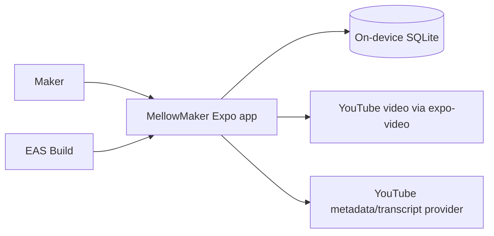

# MellowMaker Architecture

**Status:** Baseline architecture for PRD0  
**Source of truth:** [`vision.md`](./vision.md)  
**Applies to:** iOS and Android application delivered through Expo and EAS

## 1. Purpose

MellowMaker is an offline-first React Native application for crocheters. It combines a stitch dictionary, personal pattern management, interactive steps, persistent row/stitch counters, and structured guides imported from YouTube.

This document turns the product vision into technical boundaries. It intentionally avoids choosing libraries or services that the repository has not yet adopted. When the implementation establishes a convention, update this document in the same change.

## 2. Architectural drivers

1. **Offline-first core:** Stitch content, patterns, imported guide structure, notes, progress, and counters remain usable without connectivity.
2. **Local durability:** User-created data survives navigation, app restarts, and application upgrades.
3. **Cross-platform behavior:** The same product capabilities ship on iOS and Android from an Expo managed project.
4. **Fast interaction:** Counter taps and step completion update immediately and never wait for a network request.
5. **Safe evolution:** SQLite schema changes preserve existing maker data.
6. **Replaceable network integrations:** YouTube metadata and transcript capabilities are isolated from the local domain because provider behavior and availability can change.
7. **Playful, accessible UI:** Visual energy and animation must not compromise legibility, touch ergonomics, or accessibility.

## 3. System context

SQLite is the source of truth for core application state. Network services enrich imported guides and provide video playback; they are not dependencies for opening saved content or recording progress.

## 4. Technology baseline

| Concern | Baseline |
|---|---|
| Application | React Native with Expo managed workflow, SDK 52 or later |
| Language | TypeScript with strict type checking |
| Distribution | EAS builds for iOS (`.ipa`) and Android (`.aab`) |
| Local persistence | `expo-sqlite` `~57.0.1`, one application-owned database behind a synchronous connection boundary |
| Identifier generation | `expo-crypto` `~57.0.1` `randomUUID()`, injected into the data layer rather than imported by it |
| Video | `expo-video` |
| Styling | NativeWind v4 |
| Motion | React Native Reanimated |
| Platforms | iOS and Android |
| Navigation | Expo Router typed routes with Stitches, Patterns, and Guides bottom tabs |
| Transient state and forms | React hooks/context and controlled inputs with pure domain validation; no global store or form dependency |
| Unit/component tests | Jest with `jest-expo` and React Native Testing Library |
| SQL integration tests | In-memory `node:sqlite` using shared production SQL/migration inputs |
| Installed-app smoke tests | Maestro on iOS and Android targets |

Network-client libraries remain deliberately unselected. Expo Router owns typed
navigation, while durable state remains SQLite-authoritative. React hooks own
local drafts, focus, loading, and animation; narrowly scoped context may provide
stable dependencies or cross-screen ephemeral coordination, but it must never
become a second durable entity store. Controlled forms trim, parse, and validate
through pure domain functions that return discriminated success or field-error
results. A state, form, or validation dependency should be introduced only when
later feature complexity justifies changing this recorded decision.

## 5. Application boundaries

The codebase should preserve these logical layers even if the initial folder structure is compact.

Source code follows these boundaries: `src/features/<feature>/presentation`
contains screens and feature orchestration; `src/domain` contains
platform-independent entities, use cases, and validation; `src/data` contains
repository contracts and SQLite or remote implementations; `src/platform`
contains Expo/native adapters; and `src/ui` contains reusable presentation and
theme code. Direct imports are lint-restricted so domain code cannot depend on
React, React Native, Expo, or higher layers; data code cannot depend on Expo,
React Native, routes, feature presentation, or UI, keeping SQL and mapping
engine-neutral and testable without a native runtime; and feature/UI code cannot
import anything from the concrete `src/platform` implementation root. Data
contracts intended for
feature/UI consumption live under `src/data/contracts`; all other `src/data`
paths are treated as concrete implementation paths. These restrictions resolve
the imported file before checking its layer, so aliases and relative paths have
the same boundary.

### 5.1 Presentation

Screens, navigation, accessible controls, and visual states. Presentation code may call feature use cases but must not construct SQL or depend directly on a remote provider.

Expected product areas:

- Stitch dictionary and stitch detail
- Pattern library and pattern editor
- Active pattern viewer with checklist and counter
- YouTube import flow and imported guide viewer

### 5.2 Feature/domain

Owns product behavior and platform-independent types:

- searching and reading stitch guides;
- creating, editing, ordering, and deleting patterns and steps;
- completing or reopening steps;
- incrementing, correcting, and resetting counters;
- parsing supported YouTube URLs;
- creating and editing timestamped guide steps;
- coordinating import results with local persistence.

Domain behavior must not depend on React component lifecycle or a network connection.

### 5.3 Data access

Repositories are the only feature-facing boundary to SQLite. They own queries, transactions, row-to-domain mapping, and write ordering. UI components must not contain SQL.

Remote YouTube access sits behind a separate gateway. Provider response objects are mapped into MellowMaker-owned types before reaching feature code, preventing third-party payload changes from leaking throughout the app.

### 5.4 Platform infrastructure

Contains Expo/native adapters: the `expo-sqlite` connection and the composition
of the opened, migrated app database, `expo-video` integration,
connectivity-aware network calls, and EAS/app configuration. Schema and
migrations are engine-neutral and live with the repositories in `src/data`, so
the platform layer holds no SQL. Platform differences should remain behind
narrow interfaces where practical.

## 6. Data model

Schema version 1 is the whole PRD0 schema, defined in `src/data/sqlite/migrations.ts`.
That module is the single source of schema truth for the Expo adapter and for the
`node:sqlite` integration tests, and it imports nothing.

| Table | Responsibility | Key relationships |
|---|---|---|
| `stitch` | Identity, name, abbreviation, difficulty, summary, ownership provenance, and a normalized `search_text` | parent of `stitch_instruction` |
| `stitch_instruction` | Ordered instruction text and local image asset key | `stitch_id` → `stitch`, cascade |
| `pattern` | Maker-owned project metadata and notes | parent of steps, progress, counters |
| `pattern_step` | Ordered row/instruction text for one pattern | `pattern_id` → `pattern`, cascade |
| `pattern_progress` | One row per pattern holding the active position | `pattern_id` → `pattern` cascade; `active_step_id` → `pattern_step` **set null** |
| `pattern_step_progress` | One row per step holding its `completed_at` instant | `step_id`/`pattern_id` cascade |
| `imported_guide` | Canonical YouTube identity (`video_id` unique), URL, title, creator, thumbnail, notes, metadata sync instant | parent of guide steps and counters |
| `guide_step` | Ordered instruction, optional `video_offset_ms`, transcript excerpt, note, completion, and `origin` | `guide_id` → `imported_guide`, cascade |
| `counter` | Durable count, kind, maker label, and position for exactly one owner | `pattern_id` or `guide_id`, cascade |

`pattern_progress` is deliberately split in two: one row per pattern for the
active position and one row per step for completion. Each has a single job, both
cascade cleanly, and a viewer restores position and completion with two bounded
reads.

Conventions every table follows:

| Rule | Decision |
|---|---|
| Identity | `id TEXT PRIMARY KEY` holding a generated v4 UUID. Never a name, slug, or list position. |
| Timestamps | `INTEGER` milliseconds since the Unix epoch, UTC, in a column whose name ends in `_at`. One unit everywhere. |
| Calendar dates | A wall-clock date stores ISO-8601 `YYYY-MM-DD` `TEXT`. Version 1 has no such column; every temporal value is an instant. Conversion to local time happens only in presentation. |
| Ordering | Explicit `position INTEGER NOT NULL CHECK (position >= 0)`, contiguous from 0 within its parent, `UNIQUE (<parent>_id, position)`. Reads always `ORDER BY position ASC, id ASC`. |
| Recency | `pattern` has no manual position; the library orders by `updated_at DESC, id ASC` through `pattern_recent_idx`. Manual positions exist only where the maker reorders: stitch instructions, pattern steps, guide steps, counters. |
| Booleans | Not stored. Completion is a nullable `completed_at` instant, so "when" is never lost. |
| Deletion | Every child of an aggregate root is `ON DELETE CASCADE`. The single exception is `pattern_progress.active_step_id`, which is `ON DELETE SET NULL` so deleting one step clears the pointer instead of destroying the pattern's progress. `ON UPDATE` is omitted because identifiers are immutable. |
| Ownership | `stitch.ownership` (`seed`/`user`), `stitch.seed_version`, and `stitch.user_modified_at` make bundled and maker content distinguishable. A seed import may insert or update only rows where `ownership = 'seed'` and `user_modified_at IS NULL`. `pattern`, `imported_guide`, and their children are always maker-owned and carry no ownership column. |
| Search | `stitch.search_text` is a stored generated column, `lower(trim(name)) \|\| ' ' \|\| lower(trim(abbreviation))`, indexed, so case- and whitespace-insensitive lookup cannot drift from its source columns. |
| Exclusive owners | `counter.owner_kind` plus paired `CHECK`s guarantee exactly one pattern or one guide owner. `UNIQUE (pattern_id, position)` and `UNIQUE (guide_id, position)` order each owner independently because SQLite treats `NULL`s in a unique index as distinct. |
| Cross-parent references | A reference that must stay inside one aggregate derives its parent in SQL rather than trusting the caller. `pattern_progress.active_step_id` and `pattern_step_progress.pattern_id` are both written by `INSERT ... SELECT ... FROM pattern_step WHERE id = ?`, so a step from another pattern — or no step at all — writes nothing instead of pointing a pattern at a position it does not own. |
| Text | Trimmed by the caller before insert; the schema never trims silently except in the generated search column. |

## 7. SQLite lifecycle

1. **One connection.** `src/platform/database/expoSqliteConnection.ts` opens
   `mellowmaker.db` once with `SQLite.openDatabaseSync` (the cached default
   connection), sets `PRAGMA journal_mode = WAL`, and adapts the synchronous
   `expo-sqlite` API to `SqliteConnection` — the one engine-neutral SQL surface
   every data module uses. `getFirstSync`'s `null` becomes `undefined` so callers
   have a single absent value. WAL is set only in the platform adapter, because it
   is a property of the real file rather than of the in-memory test harness.
2. **Foreign keys.** `initializeDatabase` runs `PRAGMA foreign_keys = ON` outside
   any transaction (the pragma is a no-op inside one), reads it back, and throws
   `DatabaseError('foreign-keys-unavailable')` unless it reports `1`.
3. **Version.** `PRAGMA user_version` is the authoritative integer schema version.
   It lives in the file header and is transactional with the migration that sets
   it, so it cannot desync from the schema. A version above the latest known
   migration throws `DatabaseError('unsupported-schema-version')` and touches
   nothing: a downgraded app must never rewrite a newer database.
4. **Migrations.** Pending migrations run in ascending version order, each inside
   one `BEGIN IMMEDIATE` transaction that ends by setting `PRAGMA user_version`.
   `BEGIN IMMEDIATE` takes write intent up front. Pragmas cannot be
   parameterized, so the version is interpolated after `Number.isInteger`
   validation; this is the single documented exception to parameterized SQL and it
   never touches maker input.
5. **Failure.** SQLite keeps DDL and `user_version` inside the transaction, so a
   failed migration rolls back schema, rows, and version together and raises
   `DatabaseError('migration-failed')` carrying the current and failing versions.
   There is no `DROP`, no delete-and-recreate, and no reset control anywhere.
   Re-running initialization after a failure is safe and resumes from the last
   good version.
6. **Error taxonomy.** `DatabaseError` (in `src/data/contracts`) carries exactly
   `open-failed`, `foreign-keys-unavailable`, `migration-failed`, and
   `unsupported-schema-version`. Its messages carry codes and version numbers
   only, never maker content.
7. **Upgrade coverage.** Every future schema change appends a migration and ships
   its own populated fixture case that asserts literal maker rows survive.

Repositories are built by `createRepositories` over one `RepositoryContext`
(connection, transaction runner, injected clock, injected identifier generator),
so `src/data` never imports Expo and tests stay deterministic. Multi-record
operations — creating a pattern with steps, saving an imported guide, applying a
seed release, reordering — run in one transaction; nested calls use savepoints so
one repository method can compose another. Because the SQL API is synchronous and
shared, a read-modify-write cannot interleave; counter and completion writes
additionally use one statement (`MAX(0, value + ?)` and an `ON CONFLICT` upsert)
so rapid interaction cannot lose an update. Reordering under
`UNIQUE (<parent>_id, position)` runs two passes inside one transaction — offset
every affected row, then write final positions — because SQLite cannot defer a
unique constraint. List reads are bounded by `Page` (default 50, hard cap 200).

Data-dependent UI is gated: `src/ui/database/DatabaseGate.tsx` takes an
`initialize` function typed only by `src/data/contracts`, owns an
`initializing`/`ready`/`failed` state machine, publishes the repositories through
narrow context, and renders children only when ready. `src/app/_layout.tsx` is the
composition root and the only place that references `src/platform`.

## 8. Offline and synchronization model

PRD0 has no account or cloud synchronization requirement. SQLite is authoritative.

| Capability | Offline behavior |
|---|---|
| Browse/search stitch dictionary | Fully available |
| Open/edit personal patterns | Fully available |
| Complete steps and use counters | Fully available and persisted immediately |
| Open saved imported guide text/steps | Fully available |
| Play a YouTube video | Network may be required; show an explicit unavailable state |
| Import or refresh YouTube metadata/transcript | Network required; failure must not alter an existing saved guide |

An import should stage and validate remote data before committing it locally. A failed refresh must leave the last saved guide usable. PRD0 does not download YouTube media for offline playback.

## 9. YouTube integration

The importer has three separate responsibilities:

1. **URL parsing:** Normalize supported YouTube URL forms into a canonical video identifier.
2. **Enrichment:** Fetch available title, thumbnail, creator, and transcript-related data through a provider adapter.
3. **Guide authoring:** Let the maker create or edit timestamped steps and instruction text regardless of transcript availability.

Automatic transcript extraction or structured breakdown is optional when no compliant, reliable provider is available; manual timestamped guide creation is the required fallback. Provider credentials must never be embedded in the client bundle. Introducing a server-side credential proxy is a separate architectural decision, not an implicit part of the mobile app.

Remote titles, creator names, thumbnails, and transcript text are untrusted input. Validate payload shape, constrain displayed content, and never execute imported text.

## 10. UI and interaction architecture

The design system follows the “Playful Craft” direction in `vision.md`:

- off-white `#F9F8F6` application backgrounds;
- white `#FFFFFF` cards with soft shadows;
- pink `#FF6B8B`, yellow `#FFD166`, teal `#06D6A0`, and blue `#118AB2` accents;
- deep ink `#26547C` text;
- chunky rounded surfaces, friendly typography, and clear hierarchy.

Centralize colors, spacing, radii, typography, and motion values rather than reproducing literals across screens. NativeWind provides styling; Reanimated provides short, purposeful state feedback. Persist the state change independently from animation completion.

Interactive controls require accessible names, roles, and state; usable touch targets; text scaling; safe-area handling; and feedback that does not rely on color alone. Reduced-motion preferences should disable or simplify nonessential animation.

## 11. State, forms, and concurrency

- SQLite owns durable state and is the only authoritative copy of persisted entities.
- Component hooks own transient input, focus, loading, and animation state.
- Narrow React context may provide stable dependencies or cross-screen ephemeral coordination, but durable records must be rebuilt from SQLite after restart.
- Controlled React Native inputs keep draft state in their owning feature. On submit, pure domain functions trim, parse, and validate, returning discriminated success or field-error results that presentation maps to accessible text.
- No global state or form dependency is adopted until a later feature demonstrates complexity that warrants revisiting this decision.
- Counter and completion commands must prevent stale reads and lost writes during rapid taps.
- Navigation away from a screen must not cancel an already acknowledged durable change.

## 12. Error handling and observability

Use user-actionable states rather than raw exceptions:

- malformed or unsupported YouTube URL;
- offline during import or playback;
- metadata or transcript unavailable;
- local database initialization/migration failure;
- corrupted or incomplete provider response;
- media playback failure.

Log technical context in development without recording pattern text, notes, transcript content, or other maker-created data unnecessarily. Production telemetry is not part of PRD0 unless introduced by a separate decision.

## 13. Build and configuration

EAS configuration must retain distinct development, preview, and production concerns without committing signing secrets. Both production store targets must be reproducible from committed configuration.

Environment-dependent service URLs or public identifiers must use Expo-supported configuration. Secrets required to call a provider cannot be protected in a distributed mobile bundle and therefore require a separately designed trusted service.

## 14. Verification strategy

The repository uses one Jest stack for pure domain tests and React Native
component/router tests: Jest, `jest-expo`, and React Native Testing Library.
Repository and migration integration tests open a fresh in-memory `node:sqlite`
database through the production `SqliteConnection` boundary and run the
production `MIGRATIONS`, so they execute the same SQL and migration inputs as the
Expo adapter rather than maintaining a second schema. Every harness connection is
created with `enableForeignKeyConstraints: false`, because `node:sqlite` enables
foreign keys by default and would otherwise pass even if the initializer never
enabled enforcement.

The Jest `expo-sqlite` mock (`tests/support/expoSqliteMock.ts`) is backed by the
same in-memory engine and implements only `execSync`, `runSync`, `getAllSync`,
`getFirstSync`, and `closeSync`, throwing on anything else so adapter drift is
caught rather than silently mocked away. Component and router tests therefore run
the real migrations and repositories. `expo-crypto` is mocked with Node's
`randomUUID`, which has the same RFC 4122 v4 contract.

Node SQLite and that mock prove SQLite schema, query, transaction, foreign-key,
and migration behavior plus adapter JS wiring. Neither proves the `expo-sqlite`
native bridge. Maestro covers installed-app behavior on iOS and Android:
`.maestro/database.yaml` (`npm run test:smoke:database`) asserts the fresh-install
migration path and the reopen path against an already-migrated database on both
platforms.

Configured CI runs a clean npm install, lint, strict type checking, and the full
Jest suite. Maestro runs against locally installed targets using a caller-supplied
application identifier until the EAS issue provides dedicated artifacts.

Every release candidate should exercise, on both platforms where applicable:

1. cold start with existing data and no network;
2. stitch search and detail;
3. pattern creation, step completion, counter changes, and restart persistence;
4. successful and failed YouTube import;
5. saved guide access offline;
6. video playback failure and recovery.

## 15. Current non-goals

- User accounts, cloud backup, or cross-device synchronization
- Social/community features or a pattern marketplace
- Offline downloading of YouTube video
- A general-purpose backend
- Desktop-specific behavior
- Supporting crafts other than crochet in PRD0

## 16. Open decisions

These must be resolved by the issue that first needs them:

Navigation, state/forms, and verification tooling are resolved in the technology
baseline and verification sections above. The remaining decisions are:
- bundled stitch-content source, image licensing, and which stitches ship in the
  seed *content* set. The schema-level mechanism is decided in section 6: seeded
  rows carry `ownership`, `seed_version`, and `user_modified_at`, and a seed
  import may only insert or update seeded rows the maker has not edited;
- compliant YouTube metadata/transcript provider and any trusted-service need;
- feasibility of compliant YouTube playback through `expo-video`; validate the
  source format before implementation and do not scrape or reverse-engineer
  YouTube media URLs;
- whether the pattern library adds tags or folders on top of recency. The storage
  baseline is recency: `pattern` has no manual position and is indexed by
  `updated_at DESC, id ASC`;
- analytics, crash reporting, and privacy policy.

An open decision must not be resolved by quietly adding a dependency. Update this document when the repository adopts the answer.
