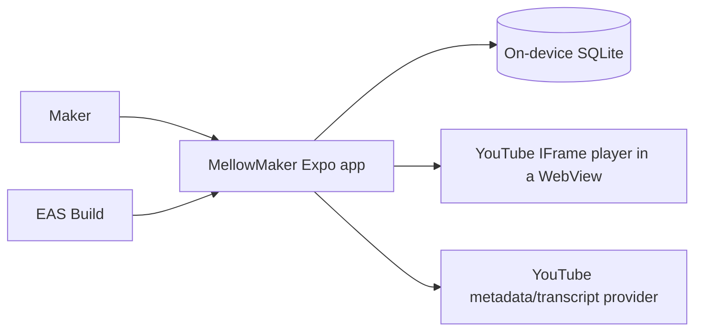

# MellowMaker Architecture

**Status:** Baseline architecture for PRD0  
**Source of truth:** [`vision.md`](./vision.md)  
**Applies to:** iOS and Android application delivered through Expo and EAS

## 1. Purpose

MellowMaker is an offline-first React Native application for crocheters. It combines a stitch dictionary, personal pattern management, interactive steps, persistent row/stitch counters, and structured guides imported from YouTube.

This document turns the product vision into technical boundaries. It intentionally avoids choosing libraries or services that the repository has not yet adopted. When the implementation establishes a convention, update this document in the same change.

## 2. Architectural drivers

1. **Offline-first core:** Stitch content, patterns, imported guide structure, notes, progress, and counters remain usable without connectivity.
2. **Local durability:** User-created data survives navigation, app restarts, and application upgrades.
3. **Cross-platform behavior:** The same product capabilities ship on iOS and Android from an Expo managed project.
4. **Fast interaction:** Counter taps and step completion update immediately and never wait for a network request.
5. **Safe evolution:** SQLite schema changes preserve existing maker data.
6. **Replaceable network integrations:** YouTube metadata and transcript capabilities are isolated from the local domain because provider behavior and availability can change.
7. **Playful, accessible UI:** Visual energy and animation must not compromise legibility, touch ergonomics, or accessibility.

## 3. System context

SQLite is the source of truth for core application state. Network services enrich imported guides and provide video playback; they are not dependencies for opening saved content or recording progress.

## 4. Technology baseline

| Concern | Baseline |
|---|---|
| Application | React Native with Expo managed workflow, SDK 52 or later |
| Language | TypeScript with strict type checking |
| Distribution | EAS builds for iOS (`.ipa`) and Android (`.aab`) |
| Local persistence | `expo-sqlite` `~57.0.1`, one application-owned database behind a synchronous connection boundary |
| Identifier generation | `expo-crypto` `~57.0.1` `randomUUID()`, injected into the data layer rather than imported by it |
| Bundled stitch content | One committed JSON document under `src/data/seed`, validated against one documented schema in the test suite and applied through `StitchRepository` |
| Video | YouTube plays through the **YouTube IFrame Player API in a WebView** (`react-native-youtube-iframe` `2.4.1` over `react-native-webview` `13.16.1`), added by issue #11 (see §9.1). `expo-video` stays in the stack only for possible future non-YouTube media. |
| Styling | NativeWind v4 |
| Motion | React Native Reanimated |
| Platforms | iOS and Android |
| Navigation | Expo Router typed routes with Stitches, Patterns, and Guides bottom tabs |
| Transient state and forms | React hooks/context and controlled inputs with pure domain validation; no global store or form dependency |
| Unit/component tests | Jest with `jest-expo` and React Native Testing Library |
| SQL integration tests | In-memory `node:sqlite` using shared production SQL/migration inputs |
| Installed-app smoke tests | Maestro on iOS and Android targets |
| Long lists | React Native `FlatList` virtualization over bounded `Page` repository reads; no third-party list dependency |
| Network metadata | The platform global `fetch` + `AbortController` (no dependency), reached through a `GuideMetadataGateway` contract in `src/data/contracts` with the oEmbed adapter in `src/platform/network`; injected `fetch` keeps it testable offline (see §9.1). Resolved by issue #9. |

The generic network-client-library question stays open, but the **one** network
need PRD0 has — best-effort YouTube metadata — is resolved by issue #9 as the
platform global `fetch` with **no added dependency** (see §9.1); a heavier HTTP
client is introduced only if a later feature justifies it. Expo Router owns typed
navigation, while durable state remains SQLite-authoritative. React hooks own
local drafts, focus, loading, and animation; narrowly scoped context may provide
stable dependencies or cross-screen ephemeral coordination, but it must never
become a second durable entity store. Controlled forms trim, parse, and validate
through pure domain functions that return discriminated success or field-error
results. A state, form, or validation dependency should be introduced only when
later feature complexity justifies changing this recorded decision.

## 5. Application boundaries

The codebase should preserve these logical layers even if the initial folder structure is compact.

Source code follows these boundaries: `src/features/<feature>/presentation`
contains screens and feature orchestration; `src/domain` contains
platform-independent entities, use cases, and validation; `src/data` contains
repository contracts and SQLite or remote implementations; `src/platform`
contains Expo/native adapters; and `src/ui` contains reusable presentation and
theme code. Direct imports are lint-restricted so domain code cannot depend on
React, React Native, Expo, or higher layers; data code cannot depend on Expo,
React Native, routes, feature presentation, or UI, keeping SQL and mapping
engine-neutral and testable without a native runtime; and feature/UI code cannot
import anything from the concrete `src/platform` implementation root. Data
contracts intended for
feature/UI consumption live under `src/data/contracts`; all other `src/data`
paths are treated as concrete implementation paths. These restrictions resolve
the imported file before checking its layer, so aliases and relative paths have
the same boundary.

### 5.1 Presentation

Screens, navigation, accessible controls, and visual states. Presentation code may call feature use cases but must not construct SQL or depend directly on a remote provider.

Expected product areas:

- Stitch dictionary and stitch detail
- Pattern library and pattern editor
- Active pattern viewer with checklist and counter
- YouTube import flow and imported guide viewer

### 5.2 Feature/domain

Owns product behavior and platform-independent types:

- searching and reading stitch guides;
- creating, editing, ordering, and deleting patterns and steps;
- completing or reopening steps;
- incrementing, correcting, and resetting counters;
- parsing supported YouTube URLs;
- creating and editing timestamped guide steps;
- coordinating import results with local persistence.

Domain behavior must not depend on React component lifecycle or a network connection.

`src/domain` exists as of the stitch dictionary. It holds the rules that both
`src/data` and a feature need to agree on, and nothing else: today that is
`stitches/stitchQuery.ts`, the one definition of what a maker's typed query
means, so the repository and the dictionary screen cannot disagree about
whether a query is blank. Lint enforces the direction — `src/domain` may not
import `@/app`, `@/features`, `@/data`, `@/platform`, `@/ui`, React, or Expo,
while `src/data` may import `src/domain`.

### 5.3 Data access

Repositories are the only feature-facing boundary to SQLite. They own queries, transactions, row-to-domain mapping, and write ordering. UI components must not contain SQL.

Remote YouTube access sits behind a separate gateway. Provider response objects are mapped into MellowMaker-owned types before reaching feature code, preventing third-party payload changes from leaking throughout the app.

### 5.4 Platform infrastructure

Contains Expo/native adapters: the `expo-sqlite` connection and the composition
of the opened, migrated app database, the YouTube IFrame player WebView (and the
`expo-video` integration reserved for future non-YouTube media),
connectivity-aware network calls, and EAS/app configuration. Schema and
migrations are engine-neutral and live with the repositories in `src/data`, so
the platform layer holds no SQL. Platform differences should remain behind
narrow interfaces where practical.

## 6. Data model

Schema version 1 is the whole PRD0 schema, defined in `src/data/sqlite/migrations.ts`.
That module is the single source of schema truth for the Expo adapter and for the
`node:sqlite` integration tests, and it imports nothing.

| Table | Responsibility | Key relationships |
|---|---|---|
| `stitch` | Identity, name, abbreviation, difficulty, summary, ownership provenance, and a normalized `search_text` | parent of `stitch_instruction` |
| `stitch_instruction` | Ordered instruction text and local image asset key | `stitch_id` → `stitch`, cascade |
| `pattern` | Maker-owned project metadata and notes | parent of steps, progress, counters |
| `pattern_step` | Ordered row/instruction text for one pattern | `pattern_id` → `pattern`, cascade |
| `pattern_progress` | One row per pattern holding the active position | `pattern_id` → `pattern` cascade; `active_step_id` → `pattern_step` **set null** |
| `pattern_step_progress` | One row per step holding its `completed_at` instant | `step_id`/`pattern_id` cascade |
| `imported_guide` | Canonical YouTube identity (`video_id` unique), URL, title, creator, thumbnail, notes, metadata sync instant | parent of guide steps and counters |
| `guide_step` | Ordered instruction, optional `video_offset_ms`, transcript excerpt, note, completion, and `origin` | `guide_id` → `imported_guide`, cascade |
| `counter` | Durable count, kind, maker label, and position for exactly one owner | `pattern_id` or `guide_id`, cascade |

**PRD0 decision 3 is resolved: one maker-labelled counter per project** (issue
#7), not separate row and stitch counters. The working view surfaces exactly one
counter the maker can name (default label **"Rows"**, `kind = 'custom'`),
obtained through the idempotent owner-keyed accessor
`CounterRepository.getOrCreatePrimaryCounter(owner)`: it returns the owner's
existing counter or, on first call, inserts one at position 0 inside a
transaction, so a mount, refresh, or reopen never creates a second row.
`renameCounter(id, label)` rewrites the maker label (the caller passes an
already-normalized, non-empty label from `src/domain/counters/counterLabel.ts`,
the shared rule so the repository default and the presentation rename cannot
disagree) and leaves the value untouched. **The single-counter choice is
enforced at the accessor and the UI, not by a new schema constraint** — the
`counter` table still permits many counters per owner, so a future *deliberate*
multi-counter decision or the guide counters (#10/#11, `owner_kind = 'guide'`)
need no migration. The trade-off is that there is no DB-level "one row per
pattern" guarantee; the idempotent accessor plus the fact that the UI never
calls `createCounter` keeps exactly one in practice, and a repository test pins
the invariant. `LATEST_SCHEMA_VERSION` stays 1: this issue ships no migration.

`pattern_progress` is deliberately split in two: one row per pattern for the
active position and one row per step for completion. Each has a single job, both
cascade cleanly, and a viewer restores position and completion with two bounded
reads.

**Guide authoring and completion (issue #10) ship with no migration.** Structured
guide authoring, the offline working view, and the guide counter reuse the
version-1 schema unchanged: `guide_step` already carries instruction, optional
`video_offset_ms`, `transcript_excerpt`, `note`, `completed_at`, `origin`, and a
contiguous `position`, and `counter` already carries the `owner_kind = 'guide'`
owner and its `guide_id` FK, so `LATEST_SCHEMA_VERSION` stays 1 and this issue
adds no migration and no dependency. Guide steps follow the same conventions as
pattern steps: an append lands at `position = current step count`, a delete
re-compacts the remainder to `0..n-1`, and a reorder validates exact membership
then runs the two-pass `reorderPositions` under `UNIQUE (guide_id, position)`.
Guide **completion is the per-step `guide_step.completed_at` instant**, written by
one absolute statement (`completed_at = now()` or `NULL`, no read-modify-write);
it deliberately does **not** bump `imported_guide.updated_at`, because completion
is working state and must not churn library recency — the same stance as pattern
completion living in a separate table. Unlike a metadata refresh, a deliberate
`updateGuideDetails` **does** rewrite the maker's title (and notes).

**Guides derive current/next and store no active pointer.** A guide has **no
`guide_progress` table** and #10 adds none (that would be a migration). The guide
working view reuses the pure `resolvePatternProgressView` with
`activeStepId: undefined`, so **current is always the first incomplete step**;
completing an out-of-order step never moves current (first-incomplete is
unchanged). The consequence is deliberate: guides have no persisted "Work on step
N" selection like the pattern viewer, only completion state and the derived
place. Timestamps are display/authoring only in #10; **issue #11 makes a
timestamped step badge a button that seeks the player** (§9.1).

The interactive pattern viewer (issue #6) reads these two tables and derives the
maker's place rather than storing it. Completion is the per-step `completed_at`
instant; the maker's position is the single `pattern_progress.active_step_id`.
The **current/next step is computed, never stored** (`src/domain/patterns/patternProgress.ts`):
it is `active_step_id` when that names an existing *incomplete* step, else the
first incomplete step by position, else none ("pattern complete"). Completing the
current step auto-advances `active_step_id` to the next incomplete step (or clears
it), so the restored position matches where the maker will work next; completing
an out-of-order step never moves the pointer. There is **no** scroll/offset
column — "viewing position" is the active step scrolled into view, and precise
scroll restoration is a presentation concern, not persisted state.

Conventions every table follows:

| Rule | Decision |
|---|---|
| Identity | `id TEXT PRIMARY KEY` holding a generated v4 UUID. Never a name, slug, or list position. |
| Timestamps | `INTEGER` milliseconds since the Unix epoch, UTC, in a column whose name ends in `_at`. One unit everywhere. |
| Calendar dates | A wall-clock date stores ISO-8601 `YYYY-MM-DD` `TEXT`. Version 1 has no such column; every temporal value is an instant. Conversion to local time happens only in presentation. |
| Ordering | Explicit `position INTEGER NOT NULL CHECK (position >= 0)`, contiguous from 0 within its parent, `UNIQUE (<parent>_id, position)`. Reads always `ORDER BY position ASC, id ASC`. |
| Recency | `pattern` has no manual position; the library orders by `updated_at DESC, id ASC` through `pattern_recent_idx`. Manual positions exist only where the maker reorders: stitch instructions, pattern steps, guide steps, counters. |
| Booleans | Not stored. Completion is a nullable `completed_at` instant, so "when" is never lost. |
| Deletion | Every child of an aggregate root is `ON DELETE CASCADE`. The single exception is `pattern_progress.active_step_id`, which is `ON DELETE SET NULL` so deleting one step clears the pointer instead of destroying the pattern's progress. `ON UPDATE` is omitted because identifiers are immutable. |
| Ownership | `stitch.ownership` (`seed`/`user`), `stitch.seed_version`, and `stitch.user_modified_at` make bundled and maker content distinguishable. A seed import may insert or update only rows where `ownership = 'seed'` and `user_modified_at IS NULL`. `pattern`, `imported_guide`, and their children are always maker-owned and carry no ownership column. |
| Search | `stitch.search_text` is a stored generated column, `lower(trim(name)) \|\| ' ' \|\| lower(trim(abbreviation))`, indexed, so case- and whitespace-insensitive lookup cannot drift from its source columns. `StitchRepository.searchStitches` matches it with two token-prefix `LIKE ? ESCAPE '\'` clauses — `q%` and `% q%` — so an abbreviation matches as a whole token (`dc` never returns *Half double crochet* through `hdc`), a multi-word name still matches across its space, and the first clause stays index-eligible. `%`, `_`, and `\` a maker typed are escaped at that boundary rather than stripped during normalization, and results are ordered `search_text ASC, id ASC` like browse. No FTS table, no dependency, no migration. |
| Exclusive owners | `counter.owner_kind` plus paired `CHECK`s guarantee exactly one pattern or one guide owner. `UNIQUE (pattern_id, position)` and `UNIQUE (guide_id, position)` order each owner independently because SQLite treats `NULL`s in a unique index as distinct. |
| Cross-parent references | A reference that must stay inside one aggregate derives its parent in SQL rather than trusting the caller. `pattern_progress.active_step_id` and `pattern_step_progress.pattern_id` are both written by `INSERT ... SELECT ... FROM pattern_step WHERE id = ?`, so a step from another pattern — or no step at all — writes nothing instead of pointing a pattern at a position it does not own. |
| Text | Trimmed by the caller before insert; the schema never trims silently except in the generated search column. |

### 6.1 Seed content

Bundled stitch content is one committed JSON document,
`src/data/seed/stitchSeed.json`, holding a document-level `seedVersion`, an
in-band `"terminology": "US"` declaration, and the records themselves. It lives
in `src/data` because that layer owns bundled data and the repository contract;
`src/domain` may not import `@/data/*`, and feature/UI code already cannot reach
a non-contract `src/data` path. JSON rather than a TypeScript literal keeps
shipped content as data validated at a boundary.

`src/data/seed/stitchSeedDocument.ts` is the one documented format. Its
`parseStitchSeedDocument` returns a discriminated result and collects every
issue, so a malformed record is a red gate rather than shipped content, and the
committed document is validated in the test suite on every run.

| Concern | Decision |
|---|---|
| Seed identity | The kebab-case `slug` is frozen at authoring time. A release is matched by slug, so a changed slug would insert a duplicate stitch. `stitch.id` stays a v4 UUID assigned on first insert and never rewritten, so later references survive content revisions. |
| Version | One monotonically increasing integer per document, never per record, stamped onto every row a release touches. |
| Launch guard | `StitchRepository.appliedSeedVersion()` reads `MAX(seed_version)` over seeded rows. An equal or higher applied version skips the import, so relaunch performs one bounded aggregate and no writes, and an older build cannot rewrite newer content — the same refusal stance as `unsupported-schema-version`. `MIN` would re-import forever once a maker edited one row. |
| Revision, not deletion | A release may add or revise records in place. No seed delete path exists in the contract, because retiring a bundled stitch would strand a maker who relies on it. |
| Maker data | The repository's `ownership = 'seed'` and `user_modified_at IS NULL` filter is the only write path, so a release never overwrites a maker edit or a maker-owned stitch. |
| Invocation | `createAppDatabase` applies the bundled content after migrations, inside its existing `try`. `DatabaseGate`'s ready state therefore means migrated *and* seeded, so dictionary screens own no seeding state, and a seed failure reuses the existing rollback-and-retry path. |
| Error taxonomy | `StitchSeedError` is deliberately outside `DatabaseError`'s four codes: invalid bundled content is not a database condition. The gate maps it to its unexpected-error state and offers a retry, and the committed content gate makes that state unreachable in a shipped build. |

The approval, authorship, imagery, attribution, and update-policy record is
[`content-provenance.md`](./content-provenance.md).

## 7. SQLite lifecycle

1. **One connection.** `src/platform/database/expoSqliteConnection.ts` opens
   `mellowmaker.db` once with `SQLite.openDatabaseSync` (the cached default
   connection), sets `PRAGMA journal_mode = WAL`, and adapts the synchronous
   `expo-sqlite` API to `SqliteConnection` — the one engine-neutral SQL surface
   every data module uses. `getFirstSync`'s `null` becomes `undefined` so callers
   have a single absent value. WAL is set only in the platform adapter, because it
   is a property of the real file rather than of the in-memory test harness.
2. **Foreign keys.** `initializeDatabase` runs `PRAGMA foreign_keys = ON` outside
   any transaction (the pragma is a no-op inside one), reads it back, and throws
   `DatabaseError('foreign-keys-unavailable')` unless it reports `1`.
3. **Version.** `PRAGMA user_version` is the authoritative integer schema version.
   It lives in the file header and is transactional with the migration that sets
   it, so it cannot desync from the schema. A version above the latest known
   migration throws `DatabaseError('unsupported-schema-version')` and touches
   nothing: a downgraded app must never rewrite a newer database.
4. **Migrations.** Pending migrations run in ascending version order, each inside
   one `BEGIN IMMEDIATE` transaction that ends by setting `PRAGMA user_version`.
   `BEGIN IMMEDIATE` takes write intent up front. Pragmas cannot be
   parameterized, so the version is interpolated after `Number.isInteger`
   validation; this is the single documented exception to parameterized SQL and it
   never touches maker input.
5. **Failure.** SQLite keeps DDL and `user_version` inside the transaction, so a
   failed migration rolls back schema, rows, and version together and raises
   `DatabaseError('migration-failed')` carrying the current and failing versions.
   There is no `DROP`, no delete-and-recreate, and no reset control anywhere.
   Re-running initialization after a failure is safe and resumes from the last
   good version.
6. **Error taxonomy.** `DatabaseError` (in `src/data/contracts`) carries exactly
   `open-failed`, `foreign-keys-unavailable`, `migration-failed`, and
   `unsupported-schema-version`. Its messages carry codes and version numbers
   only, never maker content.
7. **Upgrade coverage.** Every future schema change appends a migration and ships
   its own populated fixture case that asserts literal maker rows survive.

Repositories are built by `createRepositories` over one `RepositoryContext`
(connection, transaction runner, injected clock, injected identifier generator),
so `src/data` never imports Expo and tests stay deterministic. Multi-record
operations — creating a pattern with steps, saving an imported guide, applying a
seed release, reordering — run in one transaction; nested calls use savepoints so
one repository method can compose another. Because the SQL API is synchronous and
shared, a read-modify-write cannot interleave; counter and completion writes
additionally use one statement (`MAX(0, value + ?)` and an `ON CONFLICT` upsert)
so rapid interaction cannot lose an update. Reordering under
`UNIQUE (<parent>_id, position)` runs two passes inside one transaction — offset
every affected row, then write final positions — because SQLite cannot defer a
unique constraint. List reads are bounded by `Page` (default 50, hard cap 200).

Data-dependent UI is gated: `src/ui/database/DatabaseGate.tsx` takes an
`initialize` function typed only by `src/data/contracts`, owns an
`initializing`/`ready`/`failed` state machine, publishes the repositories through
narrow context, and renders children only when ready. `src/app/_layout.tsx` is the
composition root and the only place that references `src/platform`.

## 8. Offline and synchronization model

PRD0 has no account or cloud synchronization requirement. SQLite is authoritative.

| Capability | Offline behavior |
|---|---|
| Browse/search stitch dictionary | Fully available |
| Open/edit personal patterns | Fully available |
| Complete steps and use counters | Fully available and persisted immediately |
| Open saved imported guide text/steps | Fully available |
| Play a YouTube video | Network may be required; show an explicit unavailable state |
| Import or refresh YouTube metadata/transcript | Network required; failure must not alter an existing saved guide |

An import should stage and validate remote data before committing it locally. A failed refresh must leave the last saved guide usable. PRD0 does not download YouTube media for offline playback.

## 9. YouTube integration

The importer has three separate responsibilities:

1. **URL parsing:** Normalize supported YouTube URL forms into a canonical video identifier.
2. **Enrichment:** Fetch available title, thumbnail, creator, and transcript-related data through a provider adapter.
3. **Guide authoring:** Let the maker create or edit timestamped steps and instruction text regardless of transcript availability.

Automatic transcript extraction or structured breakdown is optional when no compliant, reliable provider is available; manual timestamped guide creation is the required fallback. Provider credentials must never be embedded in the client bundle. Introducing a server-side credential proxy is a separate architectural decision, not an implicit part of the mobile app.

Remote titles, creator names, thumbnails, and transcript text are untrusted input. Validate payload shape, constrain displayed content, and never execute imported text.

### 9.1 Compliant sources — resolved (issue #8)

Issue #8 resolved the compliant source model for all three responsibilities
(PRD0 decisions 5 and 6). Two non-negotiable constraints govern every choice: no
design may **scrape or reverse-engineer YouTube media URLs**, and no design may
**embed a private credential in the client bundle** (AC #5; NFR-11/13). The
following is the recorded architecture; playback is implemented in #11 and URL
parsing in #9.

**Implemented in issue #9 (URL identity + metadata).** The URL matrix below is
implemented as the pure `src/domain/guides/youtubeUrl.ts` normalizer, extended to
also accept the two legacy/compliant forms the original table omitted —
`youtube.com/v/ID` (legacy embed path) and `youtube-nocookie.com/embed/ID`
(privacy-enhanced domain), both normalizing to the same bare 11-char id. Metadata
is the oEmbed path below, realized as a MellowMaker-owned `GuideMetadataGateway`
contract (`src/data/contracts`) whose oEmbed adapter lives in
`src/platform/network/youtubeOembedGateway.ts` and uses the injected platform
global `fetch` (**no dependency added**); a pure `mapOembedResponse` shape-checks
the provider payload into owned types at the boundary, keeps only the four safe
string fields, and **never returns the provider `html`** — the owned type has no
`html` and no transcript field, so neither can be rendered or claimed. The gateway
is surfaced to features through a narrow `src/ui/guides` context wired at the
composition root. A guide is deduplicated on `imported_guide.video_id UNIQUE`; a
refresh updates provider display fields only, never the maker's title and never a
`guide_step`, and a failed fetch performs no write.

**URL matrix and canonical identity (FR-YT-02/03).** Every supported form carries
an 11-character video id matching `[A-Za-z0-9_-]{11}`. Normalization extracts that
id and **discards everything else** (playlist, timestamp, tracking params); the
canonical identity is the bare id (`imported_guide.video_id`, unique), so the same
video pasted in any form never duplicates. Validation is a pure function—no
network needed—so it is unit-testable at the narrowest level (NFR-16).

| Input form | Example | Canonical id |
|---|---|---|
| `watch?v=` | `https://www.youtube.com/watch?v=dQw4w9WgXcQ` | `dQw4w9WgXcQ` |
| short link | `https://youtu.be/dQw4w9WgXcQ` | `dQw4w9WgXcQ` |
| Shorts | `https://www.youtube.com/shorts/dQw4w9WgXcQ` | `dQw4w9WgXcQ` |
| embed | `https://www.youtube.com/embed/dQw4w9WgXcQ` | `dQw4w9WgXcQ` |
| live | `https://www.youtube.com/live/dQw4w9WgXcQ` | `dQw4w9WgXcQ` |
| with extra params | `https://youtu.be/dQw4w9WgXcQ?t=42&si=abc` | `dQw4w9WgXcQ` (params dropped; `t` may seed a step timestamp but is not part of identity) |
| watch + playlist | `https://www.youtube.com/watch?v=dQw4w9WgXcQ&list=PLxxxx` | `dQw4w9WgXcQ` (playlist ignored) |
| host variants | `m.youtube.com`, `music.youtube.com`, `www.`/no-`www.`, `http`/`https` | normalize host, then as above |

Input is **rejected with an actionable message** (FR-YT-02) when it is a
non-YouTube host, a YouTube URL with no extractable 11-character id (for example a
channel `/@handle`, a playlist-only `?list=` with no `v=`, or `results?search_query=`),
or any candidate id that fails the `[A-Za-z0-9_-]{11}` shape.

**Metadata — YouTube oEmbed (FR-YT-04/05/06).** Metadata comes from
`GET https://www.youtube.com/oembed?url=<encoded watch url>&format=json`. It is a
fully public endpoint with **no API key or credential**, so it satisfies the
no-secret constraint with no proxy and no offline-first violation. Fields used:
`title`, `author_name`, `author_url` (creator), `thumbnail_url`. The `html`/
`width`/`height` embed snippet is **not executed**—all fields are treated as
display-only untrusted text, shape-validated, never rendered as markup or code
(FR-GU-07, NFR-12). It is unofficial-but-public with no documented SLA or
rate-limit, so any non-200, timeout, private/removed/age-restricted video, or
malformed body is treated as "metadata unavailable": fields stay blank and
editable and manual guide creation proceeds (FR-YT-05/06, FR-DA-05). A failed
refresh must not overwrite locally edited fields or duplicate steps (FR-YT-07).
The keyed **YouTube Data API v3** (`videos.list`) is **rejected for the client**
because it requires an API key—exactly the embedded secret AC #5 / NFR-11/13
forbid; doing it compliantly would need a trusted server holding the key, a
backend PRD0 excludes.

**Transcripts — optional / manual only (FR-YT-08, FR-GU-08).** No compliant public
API returns transcripts for arbitrary videos: the Data API `captions.download`
requires OAuth from the video's owner and cannot read arbitrary or auto-generated
captions, and popular "transcript API" libraries scrape YouTube's internal
`timedtext` endpoint (non-compliant and brittle). Transcript support therefore
ships as an **optional manual field**—a maker-entered excerpt or note per step—and
the app never claims a transcript exists when none was provided. This is the only
PRD0 path; no scraping dependency is added.

**Playback — YouTube IFrame Player API in a WebView (FR-GU-04, FR-GU-06).**
Recorded blocking evidence for AC #4: `expo-video` plays a `VideoSource` pointing
at a **direct media file or stream** (progressive `mp4`, HLS, DASH); it is not a
YouTube player and has no YouTube support, and the only way to feed a YouTube
video into it is a direct media-stream URL obtainable only by scraping—prohibited.
Compliant YouTube playback through `expo-video` is therefore **not feasible**, and
the approved product revision (recorded in `docs/vision.md` and `docs/prd0.md` §5
with the owner's approval) plays YouTube inside **YouTube's own official IFrame
player, rendered in a WebView** via `react-native-youtube-iframe` over
`react-native-webview`—both Expo-managed-workflow compatible (NFR-07). It plays
within YouTube's player (no ToS violation) and exposes `seekTo(seconds)`, exactly
what FR-GU-04 needs. When online it embeds above the timestamped steps; when the
video is unavailable or offline it degrades to a **link-out to the YouTube app**
plus the saved steps and progress read from SQLite (FR-GU-06). The WebView and any
player subscription are released on view teardown (NFR-10). These offline-first
guarantees are unchanged: saved guide text, steps, and progress never depend on
the network. `expo-video` remains in the stack only for possible future
first-party/self-hosted media.

**Dependencies (added by issue #11).** `react-native-webview` `13.16.1` (the
version Expo SDK 57 pins in `bundledNativeModules.json`; native module,
autolinked, no config plugin) and `react-native-youtube-iframe` `2.4.1` (pure JS
wrapper over the WebView; no native code of its own, peer `react-native-webview
>=7` satisfied). Both resolve via autolinking, so **no `app.json` config plugin or
prebuild change** is required. These are the project's first two runtime
dependencies; nothing else — and no `expo-video` — was added. Jest **mocks
`react-native-youtube-iframe`** (a `forwardRef` stub exposing a `seekTo` spy) so
the suites run without a real WebView; no `transformIgnorePatterns` change is
needed. The on-device proving spike (a canonical id renders and seeks on iOS and
Android under EAS, with the offline link-out fallback) remains an on-device check,
logged in `docs/runbooks/smoke-verification.md`.

**Player seam — filled by issue #11.** Issue #10 shipped the guide working view
with the video region as a `GuidePlayerPlaceholder` seam (a 16:9 card + "Open in
YouTube" link-out) marked `TODO(#11)`. Issue #11 fills that seam: a
`GuideVideoPlayer` component, driven by a `useGuidePlayer(videoId)` hook, mounts
YouTube's IFrame player at the seam, keyed to the guide's canonical `videoId`, as
a **sibling above the always-rendered step list**. It **never gates, wraps, or
disables the instructions** — the saved steps, completion, counter, and progress
stay fully readable and interactive in every player state, offline included
(FR-GU-06). The player runs a text status machine: `loading` (a polite
"Loading video…" live region) → `ready` (the embedded player) → `error`. On
`error` the WebView is torn down and the widened `GuidePlayerPlaceholder` renders
the reason text mapped from the player's `onError` reason
(`video_not_found`/`embed_not_allowed`/connectivity default), a "Try again", and
the "Open in YouTube" link-out. **Seek (FR-GU-04):** a timestamped step's badge is
a button that calls `useGuidePlayer.seekToMs(ms)`, which seeks
`seekTo(videoOffsetMsToSeconds(ms), true)` — the pure, absolute
`videoOffsetMsToSeconds(ms) = max(0, ms)/1000` conversion (e.g. `42000 → 42`) —
**only when `ready`**; before ready, after error, or after unmount it is a guarded
no-op, so the instructions are never blocked. **Lifecycle (NFR-10 / AC#4):** the
player is released on **blur, not only on unmount** — `GuideWorkingViewReady`
drives `useGuidePlayer.release()` from `useFocusEffect`'s blur cleanup and
`resume()` from its focus body. Because guide routes are flat, hidden bottom-tab
screens, navigating away via the `canGoBack()===false` `replace('/guides')`
fallback leaves the view **mounted** (only blurred); a purely unmount-tied release
would leave the WebView running off-screen. On blur a `live` ref flips false
(suppressing any in-flight `onReady`/`onError`/seek), the player ref is nulled, and
the component unmounts the `<YoutubePlayer>` (real native WebView teardown); on
focus it re-arms and remounts for a fresh load. **Retry (AC #3):** `retry()` returns the machine to `loading`
and bumps a remount key only — it reads and writes **no** repository, so recovery
can never duplicate or mutate local guide data. No implementation scrapes or
reverse-engineers YouTube media URLs — playback is purely the sanctioned IFrame
embed of `videoId` (AC #5).

## 10. UI and interaction architecture

The design system follows the “Playful Craft” direction in `vision.md`:

- off-white `#F9F8F6` application backgrounds;
- white `#FFFFFF` cards with soft shadows;
- pink `#FF6B8B`, yellow `#FFD166`, teal `#06D6A0`, and blue `#118AB2` accents;
- deep ink `#26547C` text;
- chunky rounded surfaces, friendly typography, and clear hierarchy.

Centralize colors, spacing, radii, typography, and motion values rather than reproducing literals across screens. NativeWind provides styling; Reanimated provides short, purposeful state feedback. Persist the state change independently from animation completion.

Interactive controls require accessible names, roles, and state; usable touch targets; text scaling; safe-area handling; and feedback that does not rely on color alone. Reduced-motion preferences should disable or simplify nonessential animation.

Shared primitives exist so a second copy of the same behaviour never appears:
`useScreenContentInsets` owns the safe-area plus token padding every screen
uses (`Screen` applies it to its `ScrollView`; a screen that owns a virtualized
list applies it directly rather than nesting a `FlatList` in a `ScrollView`),
`usePressScale` owns the reduced-motion-aware press feedback behind
`CraftPressable` and `CraftTabBarButton`, and `CraftTextField` owns the one
controlled input.

A screen reading local data presents four labelled states, as the stitch
dictionary does: a `progressbar` while the first read runs, the loaded content,
an empty result that names the query and offers a way back to browse, and an
`alert` with a retry for a failed read. A post-ready read failure is
screen-local — `DatabaseGate` owns open/migrate/seed, so one bad read must not
black out the whole app. A search field belongs above its list, never in
`ListHeaderComponent`, so a list re-render cannot remount it and drop keyboard
focus mid-word. A list-owning screen re-reads its first page on focus
(`useFocusEffect`) so a change made on a pushed editor is reflected on return,
keeping SQLite authoritative without a global store.

Two further shared conventions, introduced by the pattern editor (issue #5):

- **Ordered-list reorder is button-driven.** Reorderable rows expose accessible
  "Move up" / "Move down" controls (disabled at the ends via
  `accessibilityState`) rather than a drag gesture, so reordering needs no
  third-party list dependency and works with a screen reader. The persisted
  positions stay contiguous from zero: deleting a row re-compacts the remainder
  so an append at `position = count` can never collide with the
  `UNIQUE (parent_id, position)` constraint.
- **Destructive confirmation uses `CraftConfirmDialog`.** It is the one shared
  accessible confirmation surface: an in-tree overlay (not a React Native
  `Modal`, to stay testable and match the no-portal habit) that announces its
  message as an assertive `alert`, spells the consequence out in words rather
  than colour, and on Android cancels on the hardware back button. Deliberate
  deletion of a whole pattern is confirmed through it because confirming
  discards the pattern's saved progress; lower-stakes edits such as removing a
  single step during editing stay immediate.

Two conventions introduced by the interactive pattern viewer (issue #6):

- **A pattern's home is its working viewer.** The canonical route
  `/patterns/[patternId]` is the interactive viewer (folder `index.tsx`), and
  structural editing lives on the child route `/patterns/[patternId]/edit`
  (`edit.tsx`), reached from the viewer's "Edit pattern" control. This matches
  vision Journey B: a library row and the post-create redirect both open the
  viewer, and the editor is one push deeper. Both child routes stay `href:null`
  so the tab bar remains exactly `Stitches / Patterns / Guides`.
- **`CraftPressable` expresses completion state, never colour alone.** The shared
  press primitive accepts an optional `accessibilityRole="checkbox"` with
  `checked`, and an optional `selected`, defaulting to the plain button so every
  existing caller is unchanged. A step's completion is an accessible checkbox and
  the current step is `selected`; status is additionally stated in words (a
  status pill and the step's label) and in shape (a check vs empty circle, a left
  accent bar and marker on the current step), so meaning survives without colour
  (A11Y-01/03, UX-05). A completion announcement and the progress summary use a
  polite live region.

## 11. State, forms, and concurrency

- SQLite owns durable state and is the only authoritative copy of persisted entities.
- Component hooks own transient input, focus, loading, and animation state.
- Narrow React context may provide stable dependencies or cross-screen ephemeral coordination, but durable records must be rebuilt from SQLite after restart.
- Controlled React Native inputs keep draft state in their owning feature. On submit, pure domain functions trim, parse, and validate, returning discriminated success or field-error results that presentation maps to accessible text.
- No global state or form dependency is adopted until a later feature demonstrates complexity that warrants revisiting this decision.
- Counter and completion commands must prevent stale reads and lost writes during rapid taps.
- Navigation away from a screen must not cancel an already acknowledged durable change.
- **Working-view command convention (issue #6).** Durable working-view commands
  — step completion and active position now, the counter (#7) and later features
  next — are absolute, idempotent, set-based SQL keyed by the target row (an
  `ON CONFLICT` upsert taking an absolute value, never a counter/array mutation),
  applied through a synchronous serialized runner (`usePatternViewer`'s `run`)
  that writes then re-reads. There is **no read-modify-write** and the UI never
  computes a `!state` toggle: each control shows an absolute "Mark complete" or
  "Reopen" action fixed by the last-committed status. Because `expo-sqlite` is
  synchronous over one shared connection and each write is one autocommitted
  statement, rapid or interleaved taps commit in issue order and the final state
  equals the last command per row — no duplicate, skip, or corruption (FR-PV-06,
  NFR-02). Persistence is independent of Reanimated animation completion
  (NFR-08). This is the convention #7/#12/#14 inherit.
- **Counter commands (issue #7) inherit that convention.** The project counter's
  `useCounter` hook resolves the owner's primary counter once (idempotent
  accessor) and applies increment, decrement, reset, and rename through the same
  synchronous serialized runner (write, then re-read the returned row). Each
  command issues **one absolute-delta SQL statement** — `adjustCounter` is
  `UPDATE counter SET value = MAX(0, value + ?) …` (the zero clamp lives in SQL,
  so a decrement can never go negative and the UI never computes `value - 1`),
  reset is `SET value = 0`, rename touches only the label. There is no
  read-modify-write and the UI never writes a value computed from a rendered
  count, so a rapid double-tap commits both deltas in issue order and lands on
  exactly the sum (FR-CO-07). The value-change "pop" and press feedback are
  gated on `useReducedMotion()` (the codebase's reduced-motion method, shared
  with `usePressScale`) and no durable write waits on an animation (FR-CO-08,
  NFR-08). The reusable `CraftCounter` control is presentational only and
  owner-generic, so the guide working views (#10/#11) reuse it unchanged; its
  read failure is screen-local and retryable, never blacking out the step list.
- **The guide working view (issue #10) inherits both conventions unchanged.**
  `useGuideViewer` applies completion through the same synchronous serialized
  write-then-re-read runner, and each completion is one absolute
  `setGuideStepCompleted` statement (`completed_at = now()` or `NULL`, no
  read-modify-write, no `!state` toggle), so rapid taps commit in issue order and
  land on the last command per step. Because a guide's completion lives on the
  step rows, the runner re-reads `getGuideWithSteps` rather than a separate
  progress table. The guide counter reuses
  `getOrCreatePrimaryCounter({ kind: 'guide', id })` + `useCounter` +
  `CraftCounter` unchanged, keyed by the guide id and isolated from every other
  pattern and guide by the `guide_id` column and its per-owner unique index — the
  "no new plumbing" reuse #7 intended. `useCounter` lives under
  `src/features/patterns/presentation` and the guide screen imports it
  cross-feature; feature→feature is not restricted by the boundary lint (which
  restricts domain/data/platform/ui edges only), so this is deliberate reuse
  rather than a second convention.

## 12. Error handling and observability

Use user-actionable states rather than raw exceptions:

- malformed or unsupported YouTube URL;
- offline during import or playback;
- metadata or transcript unavailable;
- local database initialization/migration failure;
- corrupted or incomplete provider response;
- media playback failure.

Log technical context in development without recording pattern text, notes, transcript content, or other maker-created data unnecessarily. Production telemetry is not part of PRD0 unless introduced by a separate decision.

## 13. Build and configuration

EAS configuration must retain distinct development, preview, and production concerns without committing signing secrets. Both production store targets must be reproducible from committed configuration.

Environment-dependent service URLs or public identifiers must use Expo-supported configuration. Secrets required to call a provider cannot be protected in a distributed mobile bundle and therefore require a separately designed trusted service.

## 14. Verification strategy

The repository uses one Jest stack for pure domain tests and React Native
component/router tests: Jest, `jest-expo`, and React Native Testing Library.
Repository and migration integration tests open a fresh in-memory `node:sqlite`
database through the production `SqliteConnection` boundary and run the
production `MIGRATIONS`, so they execute the same SQL and migration inputs as the
Expo adapter rather than maintaining a second schema. Every harness connection is
created with `enableForeignKeyConstraints: false`, because `node:sqlite` enables
foreign keys by default and would otherwise pass even if the initializer never
enabled enforcement.

The Jest `expo-sqlite` mock (`tests/support/expoSqliteMock.ts`) is backed by the
same in-memory engine and implements only `execSync`, `runSync`, `getAllSync`,
`getFirstSync`, and `closeSync`, throwing on anything else so adapter drift is
caught rather than silently mocked away. Component and router tests therefore run
the real migrations and repositories. `expo-crypto` is mocked with Node's
`randomUUID`, which has the same RFC 4122 v4 contract.

Node SQLite and that mock prove SQLite schema, query, transaction, foreign-key,
and migration behavior plus adapter JS wiring. Neither proves the `expo-sqlite`
native bridge. Maestro covers installed-app behavior on iOS and Android:
`.maestro/database.yaml` (`npm run test:smoke:database`) asserts the fresh-install
migration path and the reopen path against an already-migrated database on both
platforms, and `.maestro/dictionary.yaml` (`npm run test:smoke:dictionary`)
browses, searches, opens a stitch, and returns to the list.

`setAirplaneMode` exists only on Android, so the dictionary flow toggles it
behind `when: platform: Android` and stays platform-neutral otherwise. The iOS
half of release acceptance 3 is a manual step, not an automated one: run the
same flow on a physical iPhone with airplane mode switched on in Control Centre
(an iOS simulator has no airplane mode), and confirm browse, search, and detail
still work.

Configured CI runs a clean npm install, lint, strict type checking, and the full
Jest suite. Maestro runs against locally installed targets using a caller-supplied
application identifier until the EAS issue provides dedicated artifacts.

Every release candidate should exercise, on both platforms where applicable:

1. cold start with existing data and no network;
2. stitch search and detail;
3. pattern creation, step completion, counter changes, and restart persistence;
4. successful and failed YouTube import;
5. saved guide access offline;
6. video playback failure and recovery.

## 15. Current non-goals

- User accounts, cloud backup, or cross-device synchronization
- Social/community features or a pattern marketplace
- Offline downloading of YouTube video
- A general-purpose backend
- Desktop-specific behavior
- Supporting crafts other than crochet in PRD0

## 16. Open decisions

These must be resolved by the issue that first needs them:

Navigation, state/forms, and verification tooling are resolved in the technology
baseline and verification sections above. Bundled stitch-content source, image
licensing, and the shipping content set are resolved in section 6.1 and recorded
in [`content-provenance.md`](./content-provenance.md): the project authors and
owns the instruction text, no third-party imagery is bundled, and twelve records
ship at `seedVersion` 1. Only the imagery half could reopen, if a later decision
adopts licensed or self-produced assets; that would need a schema attribution
field and an in-app attribution surface.

Pattern organization is resolved: issue #5 confirmed **recency as the single
PRD0 pattern-organization method** (PRD0 decision 4). The library orders by
`updated_at DESC, id ASC` through `pattern_recent_idx`, every create/edit/step
mutation bumps the parent `updated_at` so recent work floats to the top, and
PRD0 adds no tags, folders, search, or filtering over patterns. Tags or folders
could only reopen this as a deliberate post-PRD0 decision with its own schema and
UI.

The counter model is resolved: issue #7 confirmed **one maker-labelled counter
per project** (PRD0 decision 3), default label "Rows", surfaced through the
idempotent `getOrCreatePrimaryCounter` accessor with the single-counter choice
enforced at the accessor and UI rather than a schema constraint (see section 6).
Separate row/stitch counters could only reopen as a deliberate post-PRD0
decision; the schema already permits it without a migration.

The YouTube source model is resolved: issue #8 confirmed the **compliant
metadata, transcript, playback, and URL-identity architecture** recorded in
section 9.1 (PRD0 decisions 5 and 6). Metadata is key-free **oEmbed**;
transcripts are **optional/manual** (no compliant provider exists); playback uses
the **YouTube IFrame Player API in a WebView**—not `expo-video`, which cannot
compliantly play YouTube—with a link-out and offline saved-guide fallback; and no
design depends on scraped media URLs or a client-embedded secret. Playback is
implemented in **#11**, which adds `react-native-youtube-iframe` `2.4.1` and
`react-native-webview` `13.16.1` (autolinked, no config plugin) and fills the #10
player seam with the `GuideVideoPlayer`/`useGuidePlayer` timestamp-seek surface;
URL parsing **and the oEmbed metadata path are implemented in #9**
(§9.1), which added **no dependency** — metadata uses the injected platform global
`fetch` behind a `GuideMetadataGateway` contract. `expo-video` stays in the stack
only for possible future non-YouTube media.

The remaining decision is:
- analytics, crash reporting, and privacy policy.

An open decision must not be resolved by quietly adding a dependency. Update this document when the repository adopts the answer.
